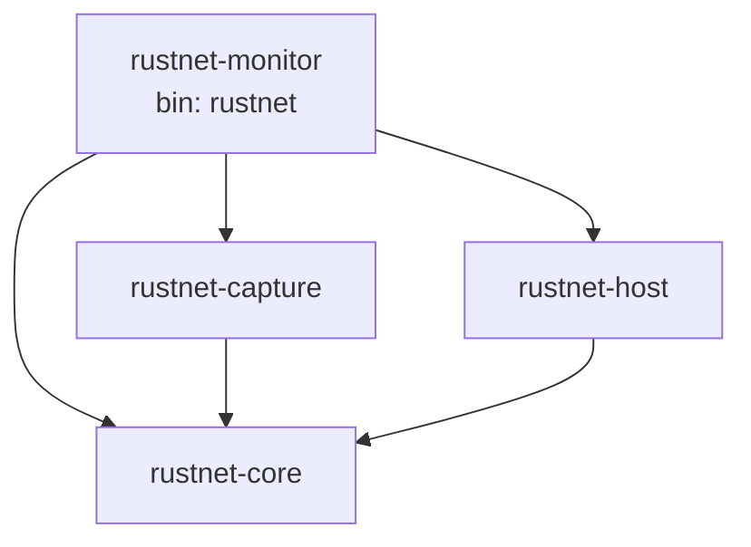
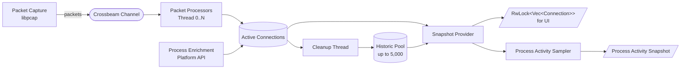

<p align="center"> <strong>English</strong> | <a href="ARCHITECTURE.zh-CN.md">简体中文</a></p>

# Architecture

This document describes the technical architecture and implementation details of RustNet.

## Table of Contents

- [Crate Structure](#crate-structure)
- [Multi-threaded Architecture](#multi-threaded-architecture)
- [Key Components](#key-components)
- [Platform-Specific Implementations](#platform-specific-implementations)
- [Performance Considerations](#performance-considerations)
- [Dependencies](#dependencies)
- [Security](#security)

## Crate Structure

RustNet is a Cargo workspace of four crates. The analysis logic, capture backend, and process attribution each live in their own reusable library crate; the binary composes them into the TUI application.

| Crate | Type | Responsibility |
| --- | --- | --- |
| [`rustnet-core`](crates/rustnet-core) | library | Platform- and capture-independent analysis core: packet parsing, protocol/connection types, deep packet inspection, link-layer parsers, connection merging, DNS/GeoIP/OUI lookups, a reusable `ConnectionTracker`, and bounded retained process-activity accounting. Operates only on byte slices and parsed structures, with no libpcap, raw sockets, or OS process tables. |
| [`rustnet-capture`](crates/rustnet-capture) | library | libpcap/Npcap packet-capture backend: device selection, BPF filters, macOS PKTAP, TUN/TAP, and a raw-frame `PacketReader`. |
| [`rustnet-host`](crates/rustnet-host) | library | Per-connection process attribution behind one `ProcessLookup` trait: eBPF/procfs on Linux, PKTAP/lsof on macOS, the IP Helper API on Windows, and `sockstat` on FreeBSD. Owns the eBPF build tooling and bundled `vmlinux.h`. |
| `rustnet-monitor` (binary `rustnet`) | binary | The user-facing application: CLI, TUI, app event loop, sandboxing (Landlock/Seatbelt), and interface statistics. Dogfoods `ConnectionTracker` as the single source of truth. |

The package is named `rustnet-monitor` because the `rustnet` crate name is taken on crates.io; the installed binary is `rustnet`.

### Dependency Graph



The graph is acyclic: `rustnet-core` has no workspace dependencies, and both `rustnet-capture` and `rustnet-host` depend only on it. Keeping `rustnet-core` a leaf lets it be published and reused independently -- a headless front-end (e.g. a Prometheus exporter) can pair `rustnet-capture` + `rustnet-core` without the TUI.

### Re-export Facade

To keep the split internal to the binary, `src/network/mod.rs` re-exports `rustnet_core::network::*` and `rustnet_capture` (as `capture`), so existing `crate::network::*` paths, integration tests, and benches compile unchanged. The `src/network/platform` module still hosts the OS sandboxing (Landlock/Seatbelt) and interface-stats collectors, and wires in `rustnet-host`'s process lookup.

## Multi-threaded Architecture

RustNet uses a multi-threaded architecture for efficient packet processing:



## Key Components

### 1. Packet Capture Thread

Uses libpcap to capture raw packets from the network interface. This thread runs independently and feeds packets into a Crossbeam channel for processing.

**Responsibilities:**
- Open network interface for packet capture (non-promiscuous, read-only mode)
- Apply BPF filters if needed
- Capture raw packets
- Stream packets to PCAP file if `--pcap-export` is enabled (direct disk write, no memory buffering)
- Feed parsed packets to the annotated PCAPNG writer if `--pcapng-export` is enabled (bounded best-effort queue)
- Send packets to processing queue

### 2. Packet Processors

Multiple worker threads (up to 4 by default, based on CPU cores) that parse packets and perform Deep Packet Inspection (DPI) analysis.

**Responsibilities:**
- Parse Ethernet, IP, TCP, UDP, ICMP, ARP headers
- Extract connection 5-tuple (protocol, src IP, src port, dst IP, dst port)
- Perform DPI to detect application protocols:
  - HTTP with host information
  - HTTPS/TLS with SNI (Server Name Indication)
  - DNS queries and responses
  - SSH connections with version detection
  - FTP control channel with commands, response codes, username, server software, and system type
  - QUIC protocol with CONNECTION_CLOSE frame detection
  - MQTT with packet types, version, and client identifier
  - BitTorrent handshakes and DHT messages
  - STUN for WebRTC and NAT traversal
  - NTP with version, mode, and stratum
  - mDNS and LLMNR for local name resolution
  - DHCP with message types and hostnames
  - SNMP (v1, v2c, v3) with PDU types
  - SSDP for UPnP device discovery
  - NetBIOS Name Service and Datagram Service
- Track connection states and lifecycle
- Update connection metadata in DashMap
- Calculate bandwidth metrics

### 3. Process Enrichment

Platform-specific APIs to associate network connections with running processes. This component runs periodically to enrich connection data with process information.

**Responsibilities:**
- Map socket inodes to process IDs
- Resolve process names and command lines
- Update connection records with process information
- Handle permission-related fallbacks

See [Platform-Specific Implementations](#platform-specific-implementations) for details on each platform.

### 4. Snapshot Provider

Creates consistent snapshots of connection data for the UI at regular intervals (default: 500ms). This ensures the UI has a stable view of connections without race conditions.

**Responsibilities:**
- Read from DashMap at configured intervals
- Apply filtering based on user criteria (localhost, etc.)
- Sort connections based on user-selected column
- Create immutable snapshot for UI rendering
- Provide RwLock-protected Vec<Connection> for UI thread

### 5. Cleanup Thread

Removes inactive connections using smart, protocol-aware timeouts. This prevents memory leaks and keeps the connection list relevant. When `--pcap-export` is enabled, also streams connection metadata (PID, process name, timestamps) to a JSONL sidecar file as connections close.

**Timeout Strategy:**

#### TCP Connections
- **HTTP/HTTPS** (detected via DPI): **10 minutes** - supports HTTP keep-alive
- **SSH** (detected via DPI): **30 minutes** - accommodates long interactive sessions
- **Generic established**: **5 minutes**
- **TIME_WAIT**: 30 seconds - standard TCP timeout
- **CLOSED**: 15 seconds - terminal archival grace
- **SYN_SENT, FIN_WAIT, etc.**: 30-60 seconds

#### UDP Connections
- **HTTP/3 (QUIC with HTTP)**: **10 minutes** - connection reuse
- **HTTPS/3 (QUIC with HTTPS)**: **10 minutes** - connection reuse
- **SSH over UDP**: **30 minutes** - long-lived sessions
- **DNS**: **30 seconds** - short-lived queries
- **Regular UDP**: **60 seconds** - standard timeout

#### QUIC Connections (Detected State)
- **Connected**: 3 minutes default, or the peer's `max_idle_timeout` transport parameter when present
- **With CONNECTION_CLOSE frame**: 15 seconds
- **Initial/Handshaking**: 60 seconds - allow connection establishment
- **Draining/Closed**: 15 seconds - terminal archival grace

Terminal connections retain the timestamp of their first terminal state.
Repeated teardown packets update final counters without postponing archival.
When a new TCP SYN reuses a closing tuple, cleanup and packet ingestion perform
one lifecycle-safe transition: the old generation is archived immutably and a
fresh live generation is created. A bounded 30-second tombstone prevents late
TCP teardown packets from creating phantom established rows.

**Visual Staleness Indicators:**

Connections change color based on proximity to timeout:
- **White** (default): < 75% of timeout
- **Yellow**: 75-90% of timeout (warning)
- **Red**: > 90% of timeout (critical)

### 6. Rate Refresh Thread

Updates bandwidth calculations every 500ms with gentle decay. This provides smooth bandwidth visualization without abrupt changes.

**Responsibilities:**
- Calculate bytes/second for download and upload
- Apply exponential decay to older measurements
- Update visual bandwidth indicators
- Maintain rolling window of packet rates

### 7. DashMap

Concurrent hashmap (`DashMap<ConnectionKey, Connection>`) for storing connection state. This lock-free data structure enables efficient concurrent access from multiple threads.

**Key Features:**
- Fine-grained locking (per-shard)
- No global lock contention
- Safe concurrent reads and writes
- High performance under concurrent load

## Platform-Specific Implementations

### Process Lookup

RustNet uses platform-specific APIs to associate network connections with processes:

#### Linux

**Standard Mode (procfs):**
- Parses `/proc/net/tcp` and `/proc/net/udp` to get socket inodes
- Iterates through `/proc/<pid>/fd/` to find socket file descriptors
- Maps inodes to process IDs and resolves process names from `/proc/<pid>/cmdline`

**eBPF Mode (Default on Linux):**
- Uses kernel eBPF programs attached to socket syscalls
- Captures socket creation events with process context
- Provides lower overhead than procfs scanning
- **Limitations:**
  - Process names limited to 16 characters (kernel `comm` field)
  - May show thread names instead of full executable names
  - Multi-threaded applications show internal thread names
- **Capability requirements:**
  - Modern Linux (5.8+): `CAP_NET_RAW` (packet capture), `CAP_BPF`, `CAP_PERFMON` (eBPF)
  - Legacy Linux (pre-5.8): eBPF requires broad `CAP_SYS_ADMIN`; RustNet packages do not grant it automatically and fall back to procfs instead
  - Note: CAP_NET_ADMIN is NOT required (uses read-only, non-promiscuous packet capture)

**Fallback Behavior:**
- If eBPF fails to load (permissions, kernel compatibility), automatically falls back to procfs mode
- TUI Statistics panel shows active detection method

#### macOS

**PKTAP Mode (with sudo):**
- Uses PKTAP (Packet Tap) kernel interface
- Extracts process information directly from packet metadata
- Requires root privileges (privileged kernel interface)
- Faster and more accurate than lsof

**lsof Mode (without sudo or fallback):**
- Uses `lsof -i -n -P` to list network connections
- Parses output to associate sockets with processes
- Higher CPU overhead but works without root
- Used automatically when PKTAP is unavailable

**Detection:**
- TUI Statistics panel shows "pktap" or "lsof" based on active method
- Automatically selects best available method

#### Windows

**IP Helper API:**
- Uses `GetExtendedTcpTable` and `GetExtendedUdpTable` from Windows IP Helper API
- Retrieves connection tables with process IDs
- Supports both IPv4 and IPv6 connections
- Resolves process names using `OpenProcess` and `QueryFullProcessImageNameW`

**Requirements:**
- May require Administrator privileges depending on system configuration
- Requires Npcap or WinPcap for packet capture

### Network Interfaces

The tool automatically detects and lists available network interfaces using platform-specific methods:

- **Linux**: Uses `netlink` or falls back to `/sys/class/net/`
- **macOS**: Uses `getifaddrs()` system call
- **Windows**: Uses IP Helper APIs (`GetAdaptersInfo()` for interface listing and
  `GetAdaptersAddresses()` for the parser's complete IPv4/IPv6 local-address set)
- **All platforms**: Falls back to pcap's `pcap_findalldevs()` when native methods fail

Packet endpoint orientation maintains a snapshot of the addresses currently assigned to
the host. Packet-processing workers refresh it every 30 seconds and, when neither unicast
endpoint is recognized as local, perform a rate-limited refresh and retry that packet once.
This keeps direction detection correct across DHCP changes, VPN connections, roaming, and
IPv6 privacy-address rotation. On Windows, `GetAdaptersAddresses()` supplements
`pnet_datalink`'s IPv4-only adapter data so temporary and stable IPv6 addresses are included.

### Process Activity Accounting

`ProcessActivityTracker` receives active and retained historic connections from the existing snapshot provider every 500ms. It calculates current rates, a 60-second window, peaks, retained totals, bandwidth shares, connection counts, and bounded destination summaries per process identity.

The interface-statistics collector keeps a compact 60-second counter window per interface. Activity coverage compares captured process bytes with interface bytes over that shared duration instead of dividing independently sampled instantaneous rates.

The cleanup thread already moves closed rows into `ConnectionTracker`'s historic pool, which retains up to 5,000 connections. Activity reuses that pool as its source of truth. It does not keep a second copy of full connections or run a separate sampling thread. Only compact rate histories, peaks, and the latest process snapshot remain Activity-specific. Historic overflow is folded into bounded process and destination buckets for each sample.

Activity and the connection UI are fed by the same active and historic sources. This keeps short-lived helper processes visible after exit until their historic rows are evicted or the user clears the connections.

## Performance Considerations

### Multi-threaded Processing

Packet processing is distributed across multiple threads (up to 4 by default, based on CPU cores). This enables:
- Parallel packet parsing and DPI analysis
- Better utilization of multi-core systems
- Reduced latency for high packet rates

### Concurrent Data Structures

**DashMap** provides lock-free concurrent access with:
- Per-shard locking (16 shards by default)
- No global lock contention
- Read-heavy workload optimization
- Safe concurrent modifications

### Batch Processing

Packets are processed in batches to improve cache efficiency:
- Multiple packets processed before context switching
- Reduced system call overhead
- Better CPU cache utilization

### Selective DPI

Deep packet inspection can be disabled with `--no-dpi` for lower overhead:
- Reduces CPU usage by 20-40% on high-traffic networks
- Still tracks basic connection information
- Useful for performance-constrained environments

### Configurable Intervals

Adjust refresh rates based on your needs:
- **UI refresh**: Default 500ms (adjustable with `--refresh-interval`)
- **Process enrichment**: Every 2 seconds
- **Cleanup check**: Every 5 seconds
- **Rate calculation**: Every 500ms

### Memory Management

**Connection cleanup** prevents unbounded memory growth:
- Protocol-aware timeouts remove stale connections
- Visual staleness warnings before removal
- Configurable timeout thresholds

**Snapshot isolation** prevents UI blocking:
- UI reads from immutable snapshots
- Background threads update DashMap concurrently
- No lock contention between UI and packet processing

## Dependencies

RustNet is built with the following key dependencies:

### Core Dependencies

- **ratatui** - Terminal user interface framework with full widget support
- **crossterm** - Cross-platform terminal manipulation
- **pcap** - Packet capture library bindings for libpcap/Npcap
- **pnet_datalink** - Network interface enumeration and low-level networking

### Concurrency & Threading

- **dashmap** - Concurrent hashmap with fine-grained locking
- **crossbeam** - Multi-threading utilities and lock-free channels

### Networking & Protocols

- **dns-lookup** - DNS resolution capabilities
- **maxminddb** - GeoIP database lookups (GeoLite2)

### Serialization

- **serde** / **serde_json** - JSON serialization for event logging and PCAP sidecar

### Command-line & Logging

- **clap** - Command-line argument parsing with derive features
- **simplelog** - Flexible logging framework
- **log** - Logging facade
- **anyhow** - Error handling and context

### Platform-Specific

- **procfs** (Linux) - Process information from /proc filesystem (runtime fallback)
- **libbpf-rs** (Linux) - eBPF program loading and management
- **landlock** (Linux) - Filesystem and network sandboxing
- **caps** (Linux) - Linux capability management
- **windows** (Windows) - Windows API bindings for IP Helper API

### Utilities

- **arboard** - Clipboard access for copying addresses
- **chrono** - Date and time handling
- **ring** - Cryptographic operations (for TLS/SNI parsing)
- **aes** - AES encryption support (for protocol detection)
- **flate2** - Gzip decompression (for compressed embedded data)
- **libc** - Low-level C bindings

## Embedded Data Files

RustNet embeds static lookup databases at compile time, avoiding runtime file dependencies. Both follow the same pattern: embed the file, parse into a `HashMap` at startup, expose a `lookup()` method.

### Service Lookup (`crates/rustnet-core/assets/services`)

Port-to-service-name mappings (e.g., 80/tcp -> http). Loaded by `ServiceLookup` in `crates/rustnet-core/src/network/services.rs` using `include_str!`.

### OUI Vendor Database (`crates/rustnet-core/assets/oui.gz`)

IEEE MA-L OUI prefix-to-vendor mappings for MAC address vendor resolution (e.g., `00:1B:63` -> Apple). Gzip-compressed to reduce binary size (~400KB compressed vs ~1.2MB raw). Decompressed at startup by `OuiLookup` in `crates/rustnet-core/src/network/oui.rs` using `include_bytes!` + `flate2`. Currently used for ARP connections only.

A GitHub Action (`.github/workflows/update-oui.yml`) updates this file monthly from the [IEEE public database](https://standards-oui.ieee.org/oui/oui.txt) and opens a PR if there are changes.

## Security

For security documentation including Landlock sandboxing, privilege requirements, and threat model, see [SECURITY.md](SECURITY.md).

## Comparison with Similar Tools

Network monitoring tools exist on a spectrum from simple connection listing to full packet forensics:

```
Simple ←─────────────────────────────────────────────────────→ Complex

netstat     iftop     bandwhich     RustNet     tcpdump     Wireshark
   │          │           │            │            │            │
   └── Socket ┴── Bandwidth ──────────┴── Live DPI ┴── Capture ──┴── Forensics
       state      monitoring             + Process     & CLI        & Deep
                                         tracking                   Analysis
```

**RustNet's position**: Real-time connection monitoring with DPI and process identification - more capable than bandwidth monitors, more focused than forensic capture tools.

### Feature Comparison

| Feature | RustNet | bandwhich | sniffnet | iftop | netstat | ss | tcpdump/wireshark |
|---------|---------|-----------|----------|-------|---------|-----|-------------------|
| **Language** | Rust | Rust | Rust | C | C | C | C |
| **Interface** | TUI | TUI | GUI | TUI | CLI | CLI | CLI/GUI |
| **Real-time monitoring** | Yes | Yes | Yes | Yes | Snapshot | Snapshot | Yes |
| **Process identification** | Yes | Yes | No | No | Yes | Yes | No |
| **Deep Packet Inspection** | Yes | No | No | No | No | No | Yes |
| **SNI/Host extraction** | Yes | No | No | No | No | No | Yes |
| **Protocol state tracking** | Yes | No | Partial | No | Yes | Yes | Yes |
| **Bandwidth per connection** | Yes | Yes | Yes | Yes | No | No | No |
| **Connection filtering** | Yes | No | Yes | Yes | No | Yes | Yes (BPF) |
| **DNS reverse lookup** | Yes | Yes | Yes | Yes | No | No | Yes |
| **GeoIP lookup** | Yes | No | Yes | No | No | No | Yes |
| **Notifications** | No | No | Yes | No | No | No | No |
| **i18n (translations)** | No | No | Yes | No | No | No | No |
| **Cross-platform** | Linux, macOS, Windows, FreeBSD | Linux, macOS | Linux, macOS, Windows | Linux, macOS, BSD | All | Linux | All |
| **eBPF support** | Yes (Linux) | No | No | No | No | Yes | No |
| **Landlock sandboxing** | Yes (Linux) | No | No | No | No | No | No |
| **JSON event logging** | Yes | No | No | No | No | No | Yes |
| **PCAP export** | Yes (+ process sidecar / annotated PCAPNG) | No | Yes | No | No | No | Yes |
| **Packet capture** | libpcap | Raw sockets | libpcap | libpcap | Kernel | Kernel | libpcap |

### Tool Focus Areas

- **RustNet**: Real-time connection monitoring with DPI, protocol state tracking, and process identification in a TUI
- **bandwhich**: Bandwidth utilization by process/connection with minimal overhead
- **sniffnet**: Network traffic analysis with a graphical interface and notifications
- **iftop**: Interface bandwidth monitoring with per-host traffic display
- **netstat/ss**: System socket and connection state inspection (ss is the modern replacement for netstat on Linux)
- **tcpdump/wireshark/tshark**: Full packet capture and protocol analysis for deep debugging

### Choosing the Right Tool

| Your Goal | Best Tool |
|-----------|-----------|
| See which process is making a connection | RustNet |
| Decode packets byte-by-byte | Wireshark |
| Monitor connection states (SYN_SENT, ESTABLISHED, etc.) | RustNet |
| Extract files or credentials from traffic | Wireshark |
| Attribute network activity to specific applications | RustNet |
| Deep protocol dissection (3000+ protocols) | Wireshark |
| Quick terminal-based network overview | RustNet |
| Save captures with process attribution | RustNet (`--pcap-export` or `--pcapng-export`) |
| Save captures for deep analysis | Wireshark/tcpdump |

### RustNet and Wireshark: Different Strengths

The key difference: **RustNet knows which process owns each connection. Wireshark cannot.**

Wireshark operates at the packet capture layer (libpcap) - it sees raw network traffic but has no visibility into which application created it. RustNet combines packet capture with OS-level socket introspection (via eBPF on Linux, /proc, or platform APIs) to attribute every connection to its owning process.

| Capability | RustNet | Wireshark |
|------------|---------|-----------|
| Process identification | Yes (eBPF, procfs, platform APIs) | No |
| Connection state tracking | Native (TCP FSM, QUIC states) | Via dissectors |
| Protocol dissectors | ~15 common protocols | 3000+ protocols |
| Packet-level inspection | Metadata only | Full payload |
| Interface | TUI (terminal) | GUI |
| Capture to file | Yes (`--pcap-export`) | Yes (native) |

Both tools can run in real-time. Choose based on what you need to see:
- **"What is making this connection?"** → RustNet
- **"What's inside this packet?"** → Wireshark

### Bridging the Gap: PCAP Export with Process Attribution

RustNet can now export packet captures while preserving process attribution - something neither tcpdump nor Wireshark can do alone:

```bash
# Capture packets with RustNet (includes process tracking)
sudo rustnet -i eth0 --pcap-export capture.pcap

# Creates:
#   capture.pcap                    - Standard PCAP file
#   capture.pcap.connections.jsonl  - Process attribution (PID, name, timestamps)

# Or write an annotated PCAPNG directly during live capture
sudo rustnet -i eth0 --pcapng-export annotated.pcapng

# Or enrich a classic PCAP after capture
python scripts/pcap_enrich.py capture.pcap -o enriched.pcapng

# Open in Wireshark - packets now show process info in comments
wireshark annotated.pcapng
```

This workflow gives you the best of both worlds:
- **RustNet's process attribution**: Know which application generated each packet
- **Wireshark's deep analysis**: Full protocol dissection with 3000+ analyzers

Native PCAPNG export embeds live best-effort packet comments directly. The enrichment script remains useful when cleanup-time sidecar metadata completeness is more important than producing a single file during capture.

See [USAGE.md - PCAP Export](USAGE.md#pcap-export) for detailed documentation.
