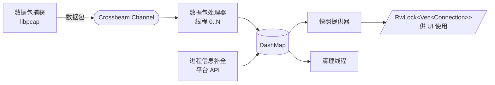

<p align="center"><a href="ARCHITECTURE.md">English</a> | <strong>简体中文</strong></p>

# 架构

本文档描述 RustNet 的技术架构和实现细节。

## 目录

- [多线程架构](#multi-threaded-architecture)
- [核心组件](#key-components)
- [平台特定实现](#platform-specific-implementations)
- [性能考量](#performance-considerations)
- [依赖项](#dependencies)
- [安全](#security)

## 多线程架构<a id="multi-threaded-architecture"></a>

RustNet 采用多线程架构以实现高效的数据包处理：



## 核心组件<a id="key-components"></a>

### 1. 数据包捕获线程

使用 libpcap 从网络接口捕获原始数据包。该线程独立运行，将数据包送入 Crossbeam channel 进行处理。

**职责：**
- 打开网络接口进行数据包捕获（非混杂、只读模式）
- 按需应用 BPF 过滤器
- 捕获原始数据包
- 如果启用了 `--pcap-export`，将数据包流式写入 PCAP 文件（直接磁盘写入，无内存缓冲）
- 将数据包发送到处理队列

### 2. 数据包处理器

多个工作线程（默认最多 4 个，基于 CPU 核心数）解析数据包并执行深度包检测（DPI）分析。

**职责：**
- 解析 Ethernet、IP、TCP、UDP、ICMP、ARP 头部
- 提取连接五元组（协议、源 IP、源端口、目的 IP、目的端口）
- 执行 DPI 检测应用协议：
  - 带主机信息的 HTTP
  - 带 SNI（Server Name Indication）的 HTTPS/TLS
  - DNS 查询和响应
  - 带版本检测的 SSH 连接
  - 带命令、响应代码、用户名、服务器软件和系统类型的 FTP 控制通道
  - 带 CONNECTION_CLOSE 帧检测的 QUIC 协议
  - 带报文类型、版本和客户端标识符的 MQTT
  - BitTorrent 握手和 DHT 消息
  - 用于 WebRTC 和 NAT 穿越的 STUN
  - 带版本、模式和 stratum 的 NTP
  - 用于本地名称解析的 mDNS 和 LLMNR
  - 带消息类型和主机名的 DHCP
  - 带 PDU 类型的 SNMP（v1、v2c、v3）
  - 用于 UPnP 设备发现的 SSDP
  - NetBIOS 名称服务和数据报服务
- 追踪连接状态和生命周期
- 在 DashMap 中更新连接元数据
- 计算带宽指标

### 3. 进程信息补全

使用平台特定的 API 将网络连接与运行中的进程关联。该组件定期运行，为连接数据补充进程信息。

**职责：**
- 将 socket inode 映射到进程 ID
- 解析进程名和命令行
- 用进程信息更新连接记录
- 处理与权限相关的回退

各平台的详情见[平台特定实现](#platform-specific-implementations)。

### 4. 快照提供器

按固定间隔（默认 1 秒）创建连接数据的一致快照供 UI 使用。这确保 UI 拥有稳定的连接视图，避免竞争条件。

**职责：**
- 按配置间隔从 DashMap 读取
- 根据用户条件应用过滤（localhost 等）
- 按用户选择的列排序连接
- 为 UI 渲染创建不可变快照
- 为 UI 线程提供 RwLock 保护的 Vec<Connection>

### 5. 清理线程

使用智能的、协议感知的超时机制移除不活跃的连接。这防止内存泄漏并保持连接列表的相关性。当启用 `--pcap-export` 时，连接关闭时还会将连接元数据（PID、进程名、时间戳）流式写入 JSONL sidecar 文件。

**超时策略：**

#### TCP 连接
- **HTTP/HTTPS**（通过 DPI 检测）：**10 分钟** —— 支持 HTTP keep-alive
- **SSH**（通过 DPI 检测）：**30 分钟** —— 适应长交互会话
- **活跃已建立**（< 1 分钟空闲）：**10 分钟**
- **空闲已建立**（> 1 分钟空闲）：**5 分钟**
- **TIME_WAIT**：30 秒 —— 标准 TCP 超时
- **CLOSED**：5 秒 —— 快速清理
- **SYN_SENT、FIN_WAIT 等**：30-60 秒

#### UDP 连接
- **HTTP/3（带 HTTP 的 QUIC）**：**10 分钟** —— 连接复用
- **HTTPS/3（带 HTTPS 的 QUIC）**：**10 分钟** —— 连接复用
- **基于 UDP 的 SSH**：**30 分钟** —— 长会话
- **DNS**：**30 秒** —— 短查询
- **普通 UDP**：**60 秒** —— 标准超时

#### QUIC 连接（检测到的状态）
- **已连接**：默认 3 分钟，或当存在对端的 `max_idle_timeout` 传输参数时使用该值
- **带 CONNECTION_CLOSE 帧**：1-10 秒（基于关闭类型）
- **Initial/Handshaking**：60 秒 —— 允许连接建立
- **Draining**：10 秒 —— RFC 9000 draining 周期
- **Closed**：1 秒 —— 立即清理

**视觉陈旧度指示器：**

连接根据距离超时的远近改变颜色：
- **白色**（默认）：< 75% 的超时时间
- **黄色**：75-90% 的超时时间（警告）
- **红色**：> 90% 的超时时间（严重）

### 6. 速率刷新线程

每秒更新带宽计算，采用温和衰减。这提供平滑的带宽可视化，避免突变。

**职责：**
- 计算下载和上传的字节/秒
- 对旧测量值应用指数衰减
- 更新可视化带宽指示器
- 维护包速率的滚动窗口

### 7. DashMap

并发哈希表（`DashMap<ConnectionKey, Connection>`）用于存储连接状态。这种无锁数据结构支持来自多个线程的高效并发访问。

**关键特性：**
- 细粒度锁定（per-shard）
- 无全局锁竞争
- 安全的并发读写
- 高并发负载下的高性能

## 平台特定实现<a id="platform-specific-implementations"></a>

### 进程查找

RustNet 使用平台特定的 API 将网络连接与进程关联：

#### Linux

**标准模式（procfs）：**
- 解析 `/proc/net/tcp` 和 `/proc/net/udp` 获取 socket inode
- 遍历 `/proc/<pid>/fd/` 查找 socket 文件描述符
- 将 inode 映射到进程 ID，并从 `/proc/<pid>/cmdline` 解析进程名

**eBPF 模式（Linux 默认）：**
- 使用附加到 socket 系统调用的内核 eBPF 程序
- 捕获带进程上下文的 socket 创建事件
- 比 procfs 扫描开销更低
- **局限性：**
  - 进程名限制为 16 个字符（内核 `comm` 字段）
  - 可能显示线程名而非完整可执行文件名
  - 多线程应用显示内部线程名
- **Linux capabilities 需求：**
  - 现代 Linux（5.8+）：`CAP_NET_RAW`（包捕获）、`CAP_BPF`、`CAP_PERFMON`（eBPF）
  - 旧版 Linux（pre-5.8）：`CAP_NET_RAW`（包捕获）、`CAP_SYS_ADMIN`（eBPF）
  - 注意：不需要 CAP_NET_ADMIN（使用只读、非混杂包捕获）

**回退行为：**
- 如果 eBPF 加载失败（权限、内核兼容性），自动回退到 procfs 模式
- TUI 统计面板显示当前使用的检测方法

#### macOS

**PKTAP 模式（使用 sudo 时）：**
- 使用 PKTAP（Packet Tap）内核接口
- 直接从包元数据提取进程信息
- 需要 root 特权（特权内核接口）
- 比 lsof 更快更准确

**lsof 模式（无 sudo 或回退时）：**
- 使用 `lsof -i -n -P` 列出网络连接
- 解析输出以将 socket 与进程关联
- CPU 开销更高，但无需 root
- 当 PKTAP 不可用时自动使用

**检测：**
- TUI 统计面板根据当前方法显示 "pktap" 或 "lsof"
- 自动选择最佳可用方法

#### Windows

**IP Helper API：**
- 使用 Windows IP Helper API 的 `GetExtendedTcpTable` 和 `GetExtendedUdpTable`
- 检索带进程 ID 的连接表
- 支持 IPv4 和 IPv6 连接
- 使用 `OpenProcess` 和 `QueryFullProcessImageNameW` 解析进程名

**需求：**
- 根据系统配置可能需要 Administrator 特权
- 包捕获需要 Npcap 或 WinPcap

### 网络接口

该工具使用平台特定的方法自动检测和列出可用网络接口：

- **Linux**：使用 `netlink` 或回退到 `/sys/class/net/`
- **macOS**：使用 `getifaddrs()` 系统调用
- **Windows**：使用 IP Helper API 的 `GetAdaptersInfo()`
- **所有平台**：当原生方法失败时回退到 pcap 的 `pcap_findalldevs()`

## 性能考量<a id="performance-considerations"></a>

### 多线程处理

数据包处理分布在多个线程上（默认最多 4 个，基于 CPU 核心数）。这实现了：
- 并行数据包解析和 DPI 分析
- 更好地利用多核系统
- 降低高包速率下的延迟

### 并发数据结构

**DashMap** 提供无锁并发访问，具备：
- Per-shard 锁定（默认 16 个 shard）
- 无全局锁竞争
- 读密集型工作负载优化
- 安全的并发修改

### 批处理

数据包以批次处理以提高缓存效率：
- 上下文切换前处理多个数据包
- 减少系统调用开销
- 更好的 CPU 缓存利用率

### 选择性 DPI

可以使用 `--no-dpi` 禁用深度包检测以降低开销：
- 在高流量网络中降低 20-40% 的 CPU 使用率
- 仍然追踪基本连接信息
- 适用于性能受限的环境

### 可配置间隔

根据需求调整刷新率：
- **UI 刷新**：默认 1000ms（可通过 `--refresh-interval` 调整）
- **进程补全**：每 2 秒
- **清理检查**：每 5 秒
- **速率计算**：每 1 秒

### 内存管理

**连接清理**防止内存无界增长：
- 协议感知的超时移除陈旧连接
- 移除前的视觉陈旧度警告
- 可配置的超时阈值

**快照隔离**防止 UI 阻塞：
- UI 从不可变快照读取
- 后台线程并发更新 DashMap
- UI 和数据包处理之间无锁竞争

## 依赖项<a id="dependencies"></a>

RustNet 使用以下关键依赖构建：

### 核心依赖

- **ratatui** —— 终端用户界面框架，带完整控件支持
- **crossterm** —— 跨平台终端操作
- **pcap** —— libpcap/Npcap 的包捕获库绑定
- **pnet_datalink** —— 网络接口枚举和低层网络

### 并发与线程

- **dashmap** —— 细粒度锁定的并发哈希表
- **crossbeam** —— 多线程工具和无锁 channel

### 网络与协议

- **dns-lookup** —— DNS 解析能力
- **maxminddb** —— GeoIP 数据库查询（GeoLite2）

### 序列化

- **serde** / **serde_json** —— 事件日志和 PCAP sidecar 的 JSON 序列化

### 命令行与日志

- **clap** —— 带 derive 特性的命令行参数解析
- **simplelog** —— 灵活的日志框架
- **log** —— 日志门面
- **anyhow** —— 错误处理和上下文

### 平台特定

- **procfs**（Linux）— 从 /proc 文件系统获取进程信息（运行时回退）
- **libbpf-rs**（Linux）— eBPF 程序加载和管理
- **landlock**（Linux）— 文件系统和网络沙箱
- **caps**（Linux）— Linux capabilities 管理
- **windows**（Windows）— IP Helper API 的 Windows API 绑定

### 工具库

- **arboard** —— 复制地址的剪贴板访问
- **chrono** —— 日期和时间处理
- **ring** —— 加密操作（用于 TLS/SNI 解析）
- **aes** —— AES 加密支持（用于协议检测）
- **flate2** —— Gzip 解压（用于压缩的嵌入式数据）
- **libc** —— 低层 C 绑定

## 嵌入式数据文件

RustNet 在编译时嵌入静态查找数据库，避免运行时文件依赖。两者遵循相同的模式：嵌入文件，启动时解析为 `HashMap`，暴露 `lookup()` 方法。

### 服务查找（`assets/services`）

端口到服务名的映射（例如 80/tcp -> http）。由 `src/network/services.rs` 中的 `ServiceLookup` 使用 `include_str!` 加载。

### OUI 厂商数据库（`assets/oui.gz`）

IEEE MA-L OUI 前缀到厂商的映射，用于 MAC 地址厂商解析（例如 `00:1B:63` -> Apple）。Gzip 压缩以减小二进制体积（压缩后约 400KB，原始约 1.2MB）。由 `src/network/oui.rs` 中的 `OuiLookup` 使用 `include_bytes!` + `flate2` 在启动时解压。

GitHub Action（`.github/workflows/update-oui.yml`）每月从 [IEEE 公开数据库](https://standards-oui.ieee.org/oui/oui.txt) 更新此文件，如有变更则自动打开 PR。

## 安全<a id="security"></a>

关于 Landlock 沙箱、权限需求和威胁模型的安全文档，参见 [SECURITY.zh-CN.md](SECURITY.zh-CN.md)。

## 与同类工具的对比<a id="comparison-with-similar-tools"></a>

网络监控工具存在于从简单连接列表到完整数据包取证的光谱上：

```
简单 ←─────────────────────────────────────────────────────→ 复杂

netstat     iftop     bandwhich     RustNet     tcpdump     Wireshark
   │          │           │            │            │            │
   └── Socket ┴── Bandwidth ──────────┴── Live DPI ┴── Capture ──┴── Forensics
       state      monitoring             + Process     & CLI        & Deep
                                          tracking                   Analysis
```

**RustNet 的定位**：实时连接监控，带 DPI 和进程识别——比带宽监控器功能更强，比取证捕获工具更聚焦。

### 功能对比

| 功能 | RustNet | bandwhich | sniffnet | iftop | netstat | ss | tcpdump/wireshark |
|---------|---------|-----------|----------|-------|---------|-----|-------------------|
| **语言** | Rust | Rust | Rust | C | C | C | C |
| **界面** | TUI | TUI | GUI | TUI | CLI | CLI | CLI/GUI |
| **实时监控** | 是 | 是 | 是 | 是 | 快照 | 快照 | 是 |
| **进程识别** | 是 | 是 | 否 | 否 | 是 | 是 | 否 |
| **深度包检测** | 是 | 否 | 否 | 否 | 否 | 否 | 是 |
| **SNI/主机提取** | 是 | 否 | 否 | 否 | 否 | 否 | 是 |
| **协议状态追踪** | 是 | 否 | 部分 | 否 | 是 | 是 | 是 |
| **逐连接带宽** | 是 | 是 | 是 | 是 | 否 | 否 | 否 |
| **连接过滤** | 是 | 否 | 是 | 是 | 否 | 是 | 是（BPF） |
| **DNS 反向解析** | 是 | 是 | 是 | 是 | 否 | 否 | 是 |
| **GeoIP 查询** | 是 | 否 | 是 | 否 | 否 | 否 | 是 |
| **通知** | 否 | 否 | 是 | 否 | 否 | 否 | 否 |
| **i18n（翻译）** | 否 | 否 | 是 | 否 | 否 | 否 | 否 |
| **跨平台** | Linux、macOS、Windows、FreeBSD | Linux、macOS | Linux、macOS、Windows | Linux、macOS、BSD | 全部 | Linux | 全部 |
| **eBPF 支持** | 是（Linux） | 否 | 否 | 否 | 否 | 是 | 否 |
| **Landlock 沙箱** | 是（Linux） | 否 | 否 | 否 | 否 | 否 | 否 |
| **JSON 事件日志** | 是 | 否 | 否 | 否 | 否 | 否 | 是 |
| **PCAP 导出** | 是（+ 进程 sidecar） | 否 | 是 | 否 | 否 | 否 | 是 |
| **数据包捕获** | libpcap | Raw sockets | libpcap | libpcap | Kernel | Kernel | libpcap |

### 工具聚焦领域

- **RustNet**：TUI 中的实时连接监控，带 DPI、协议状态追踪和进程识别
- **bandwhich**：按进程/连接的带宽利用率，开销最小
- **sniffnet**：带图形界面和通知的网络流量分析
- **iftop**：带逐主机流量显示的接口带宽监控
- **netstat/ss**：系统 socket 和连接状态检查（ss 是 Linux 上 netstat 的现代替代品）
- **tcpdump/wireshark/tshark**：用于深度调试的完整数据包捕获和协议分析

### 如何选择合适的工具

| 你的目标 | 最佳工具 |
|-----------|-----------|
| 查看哪个进程正在建立连接 | RustNet |
| 逐字节解码数据包 | Wireshark |
| 监控连接状态（SYN_SENT、ESTABLISHED 等） | RustNet |
| 从流量中提取文件或凭据 | Wireshark |
| 将网络活动归因于特定应用 | RustNet |
| 深度协议解析（3000+ 协议） | Wireshark |
| 快速终端网络概览 | RustNet |
| 保存带进程归因的捕获 | RustNet（`--pcap-export`） |
| 保存捕获用于深度分析 | Wireshark/tcpdump |

### RustNet 与 Wireshark：不同的强项

关键区别：**RustNet 知道每个连接属于哪个进程。Wireshark 不知道。**

Wireshark 在数据包捕获层（libpcap）运行——它看到原始网络流量，但不知道哪个应用创建了它。RustNet 将数据包捕获与 OS 级 socket 内省（通过 Linux eBPF、/proc 或平台 API）相结合，将每个连接归因于其所属进程。

| 能力 | RustNet | Wireshark |
|------------|---------|-----------|
| 进程识别 | 是（eBPF、procfs、平台 API） | 否 |
| 连接状态追踪 | 原生（TCP FSM、QUIC 状态） | 通过解析器 |
| 协议解析器 | ~15 个常见协议 | 3000+ 协议 |
| 数据包级检查 | 仅元数据 | 完整 payload |
| 界面 | TUI（终端） | GUI |
| 捕获到文件 | 是（`--pcap-export`） | 是（原生） |

两种工具都可以实时运行。根据你想看什么来选择：
- **"是什么在发起这个连接？"** → RustNet
- **"这个数据包里有什么？"** → Wireshark

### 弥合差距：带进程归因的 PCAP 导出

RustNet 现在可以在保留进程归因的同时导出数据包捕获——这是 tcpdump 和 Wireshark 单独都无法做到的：

```bash
# 使用 RustNet 捕获数据包（包含进程追踪）
sudo rustnet -i eth0 --pcap-export capture.pcap

# 创建：
#   capture.pcap                    - 标准 PCAP 文件
#   capture.pcap.connections.jsonl  - 进程归因（PID、名称、时间戳）

# 用进程信息富化 PCAP 并创建注释过的 PCAPNG
python scripts/pcap_enrich.py capture.pcap -o annotated.pcapng

# 在 Wireshark 中打开 —— 数据包现在显示进程信息注释
wireshark annotated.pcapng
```

这个工作流让你兼得两者之长：
- **RustNet 的进程归因**：知道哪个应用生成了每个数据包
- **Wireshark 的深度分析**：3000+ 解析器的完整协议解析

富化脚本将数据包与其 originating 进程关联，并将信息嵌入为 PCAPNG 数据包注释，在 Wireshark 的数据包详情窗格中可见。

详见 [USAGE.zh-CN.md - PCAP 导出](USAGE.zh-CN.md#pcap-export)。
