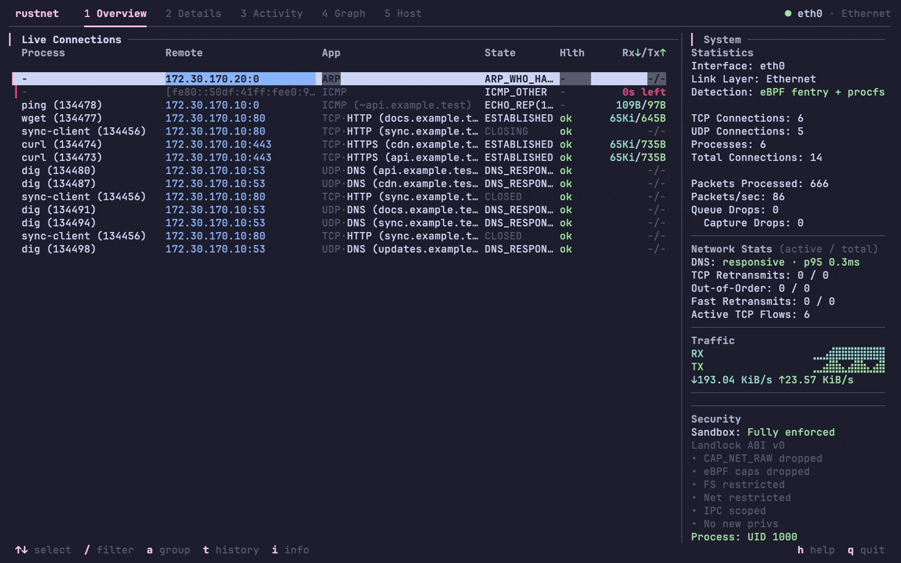
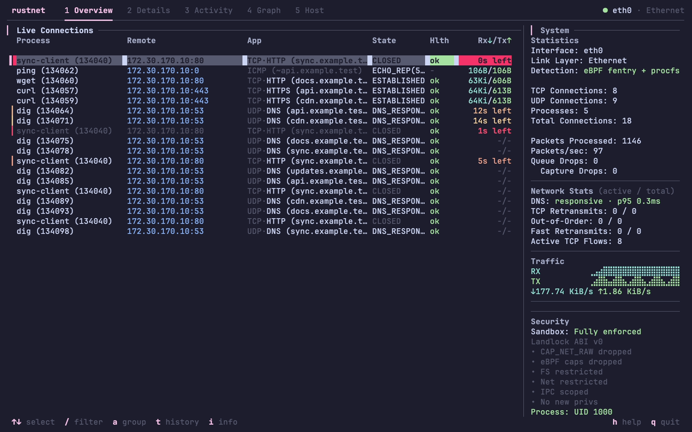
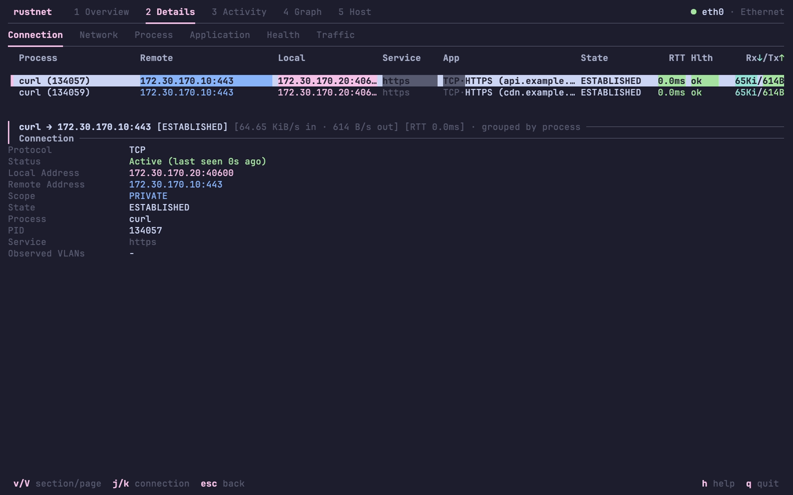
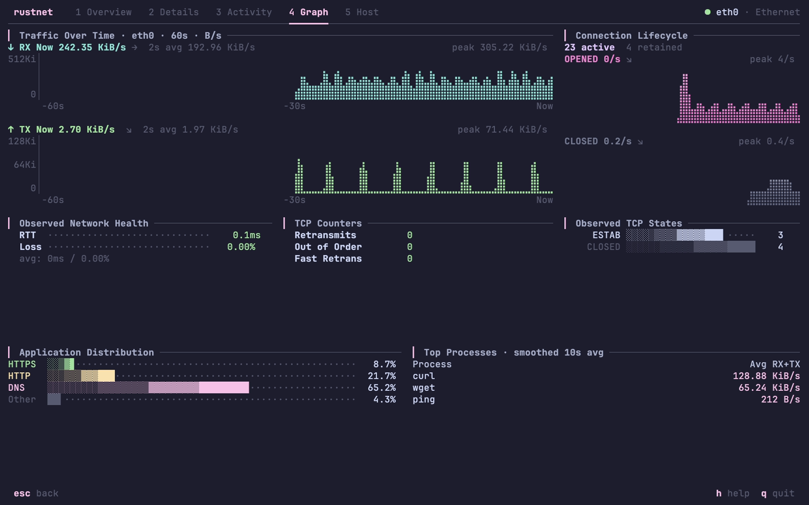
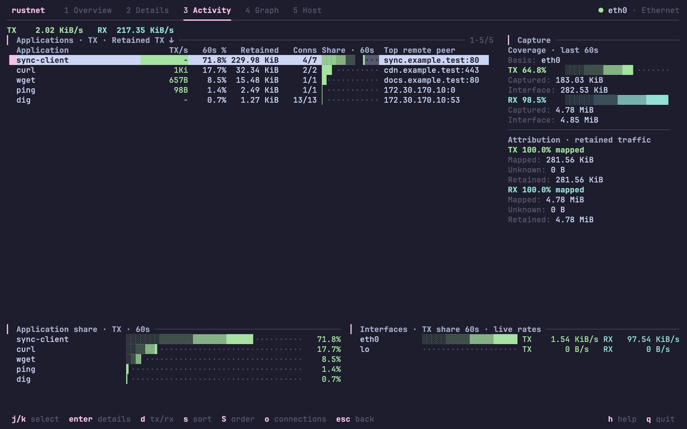
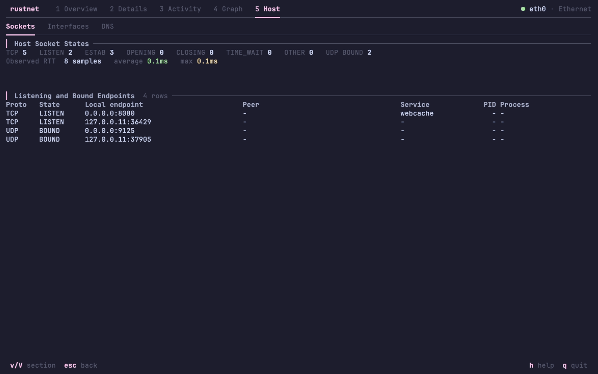
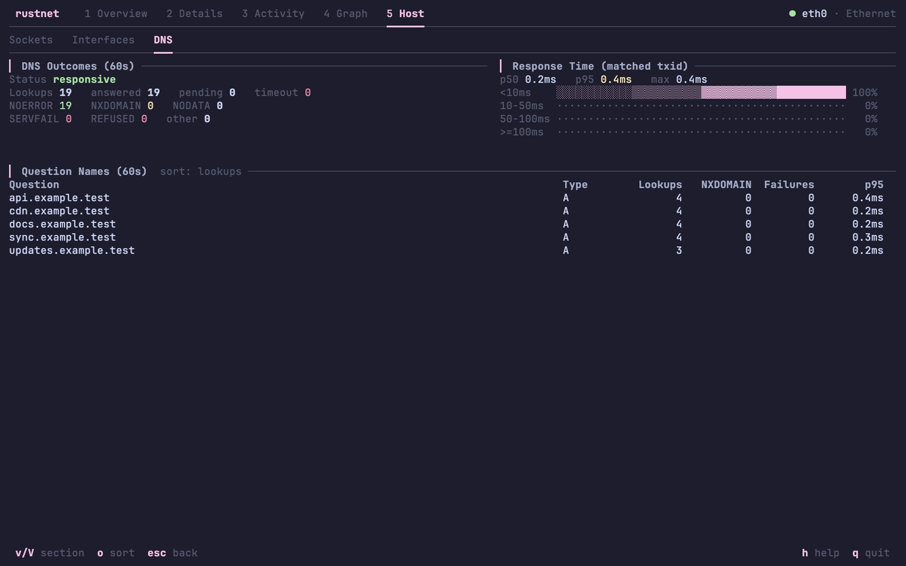

<p align="center">
  
</p>

<h1 align="center">RustNet</h1>

<p align="center">
  <a href="https://ratatui.rs/"></a>
  <a href="https://github.com/domcyrus/rustnet/actions"></a>
  <a href="https://crates.io/crates/rustnet-monitor"></a>
  <a href="https://github.com/domcyrus/rustnet/releases"></a>
  <a href="https://repology.org/project/rustnet/versions"></a>
  <a href="LICENSE"></a>
</p>

<p align="center"><a href="README.md">English</a> | <a href="README.zh-CN.md">简体中文</a> | <strong>日本語</strong></p>

RustNet は、TCP、UDP、QUIC の接続と、取得できる場合はその所有プロセスをリアルタイムで表示するターミナル向けネットワークモニターです。Linux、macOS、Windows、FreeBSD に対応しています。

## インストール

macOS または Linux で Homebrew を使う場合:

```bash
brew install rustnet
```

パケットキャプチャにはプラットフォームに応じた権限設定が必要です。Linux のケーパビリティ、macOS の PKTAP と BPF へのアクセス、ほかのパッケージマネージャー、トラブルシューティングは[インストールガイド](INSTALL.md)を参照してください。

> **リリース状況:** 以下の特長、GIF、スクリーンショットは v1.7.0 の内容です。録画には隔離した Linux 環境で生成した通信を使用しています。`main` からリンクされるガイドには[未リリースの変更](CHANGELOG.md#unreleased)も含まれる場合があります。リリース版を使う場合は [v1.7.0 のドキュメント](https://github.com/domcyrus/rustnet/blob/v1.7.0/README.ja.md)を参照し、`rustnet --version` と `rustnet --help` でバージョンと対応オプションを確認してください。

## デモ

<p align="center">
  
</p>

## 特長

- SSH 越しでも使えるターミナル UI で、接続の状態、通信量、アプリケーションプロトコルと、取得できたプロセス情報を表示します。
- パケット解析で HTTP、TLS/SNI、DNS、SSH、QUIC などを識別します。
- プロセス、アドレス、ポート、プロトコルなどで接続を絞り込みます。
- ヘッドレスモードでバージョン付き JSON スナップショットを出力し、スクリプトや監視に利用できます。
- ホストのソケット、パッシブ DNS 分析、接続の健全性を表示します。
- PCAP や、取得できた情報を注釈に含む PCAPNG を出力し、Wireshark で分析できます。
- 起動後に不要な権限を削除し、対応プラットフォームではサンドボックスを使います。

機能の詳細は[使用ガイド](USAGE.md)、[アーキテクチャガイド](ARCHITECTURE.md)、[セキュリティガイド](SECURITY.md)を参照してください。

v1.7.0 以降、Unix の出力先に信頼できるディレクトリが必要で、診断ログは排他的に新規作成されます。

v1.7.0 では、ARM DEB と古い glibc および Debian 13 の time64 ライブラリとの互換性も修正しています。対応するディストリビューションは[インストールガイド](INSTALL.md#debianubuntu-deb-packages)を参照してください。v1.6.0 の配布物には適用されません。

## スクリーンショット

<table>
  <tr>
    <td align="center"><strong>Overview</strong><br>接続と通信量をリアルタイム表示<br></td>
    <td align="center"><strong>Details</strong><br>プロセス、プロトコル、通信先の情報<br></td>
  </tr>
  <tr>
    <td align="center"><strong>Graph</strong><br>通信量とアプリケーションのグラフ<br></td>
    <td align="center"><strong>Activity</strong><br>プロセスごとの通信量<br></td>
  </tr>
  <tr>
    <td align="center"><strong>Host sockets</strong><br>待ち受け中およびバインド済みのエンドポイント<br></td>
    <td align="center"><strong>DNS</strong><br>パッシブに観測した DNS クエリと応答<br></td>
  </tr>
</table>

## その他のインストール方法

| プラットフォーム | コマンド |
| --- | --- |
| Ubuntu 22.04+ / Linux Mint 21+ | `sudo add-apt-repository ppa:domcyrus/rustnet`<br>`sudo apt update && sudo apt install rustnet` |
| Fedora 42+ | `sudo dnf copr enable domcyrus/rustnet`<br>`sudo dnf install rustnet` |
| Arch Linux | `sudo pacman -S rustnet` |
| Alpine Linux (edge/community) | `apk add rustnet` |
| Windows | `choco install rustnet` または `scoop install rustnet` |
| Cargo | `cargo install rustnet-monitor` |
| Nix / NixOS | `nix-shell -p rustnet` |

Windows では [Npcap](https://npcap.com) も必要です。v1.7.0 はデフォルト設定に対応しています。v1.6.0 では「WinPcap API compatible mode」が必要です。openSUSE、Pop!_OS、FreeBSD、Docker、ソースからのビルドについては[インストールガイド](INSTALL.md)を参照してください。

## 実行

Linux でケーパビリティを設定した後:

```bash
rustnet
```

macOS で PKTAP を使用するには `sudo` が必要です。BPF へのアクセスを設定すれば sudo なしでも実行できますが、プロセスの検出には `lsof` を使います。

`/` で絞り込み、`Enter` で詳細を表示し、`q` で終了します。インターフェースの選択、オプション、キー操作、フィルター、エクスポートについては[使用ガイド](USAGE.md)を参照してください。

## ドキュメント

- [QUIC 検査](QUIC.ja.md)：ハンドシェイク保持とライブラリ互換性（v1.7.0 以降で利用可能）。

以下の詳細ガイドは英語版です。各ガイドの先頭から簡体字中国語版にも移動できます。

- [インストール](INSTALL.md): 対応プラットフォーム、権限設定、トラブルシューティング
- [使用方法](USAGE.md): 操作、フィルター、自動化、キャプチャの出力
- [ターミナルのレイアウトと外観](TUI.ja.md)
- [セキュリティ](SECURITY.md): サンドボックスと権限管理
- [アーキテクチャ](ARCHITECTURE.md): プラットフォーム別の実装と性能
- [Kubernetes とコンテナ](KUBERNETES.ja.md): 所有者特定とキャプチャの出力
- [変更履歴](CHANGELOG.md): リリース済みおよび今後の変更
- [貢献](CONTRIBUTING.md): コントリビューションガイド

サポート対象の製品は `rustnet` バイナリです。ワークスペース内の crate の API は内部用であり、互換性を維持するための処理を残さずに変更される場合があります。

RustNet のターミナル UI には [ratatui](https://github.com/ratatui-org/ratatui)、パケットキャプチャには [libpcap](https://www.tcpdump.org/)/[Npcap](https://npcap.com/) を使用しています。貢献者は [CONTRIBUTORS.md](CONTRIBUTORS.md) を参照してください。

ライセンスは [Apache License 2.0](LICENSE) です。
