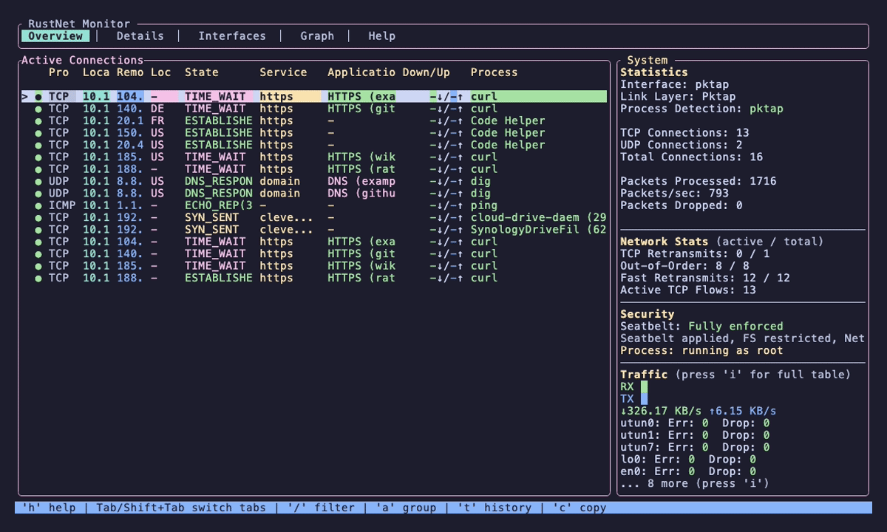

[](https://ratatui.rs/)
[](https://github.com/domcyrus/rustnet/actions)
[](https://crates.io/crates/rustnet-monitor)
[](LICENSE)
[](https://github.com/domcyrus/rustnet/releases)
[](https://github.com/domcyrus/rustnet/pkgs/container/rustnet)

# RustNet

A cross-platform network monitoring tool built with Rust. RustNet provides real-time visibility into network connections with detailed state information, connection lifecycle management, deep packet inspection, and a terminal user interface.



## Features

- **Real-time Network Monitoring**: Monitor active TCP, UDP, ICMP, and ARP connections with detailed state information
- **Connection States**: Track TCP states (`ESTABLISHED`, `SYN_SENT`, `TIME_WAIT`), QUIC states (`QUIC_INITIAL`, `QUIC_HANDSHAKE`, `QUIC_CONNECTED`), DNS states, SSH states, and activity-based UDP states
- **Interface Statistics**: Real-time monitoring of network interface metrics including bytes/packets transferred, errors, drops, and collisions
- **Deep Packet Inspection (DPI)**: Detect application protocols including HTTP, HTTPS/TLS with SNI, DNS, SSH with version detection, and QUIC with CONNECTION_CLOSE frame detection
- **TCP Network Analytics**: Real-time detection of TCP retransmissions, out-of-order packets, and fast retransmits with per-connection and aggregate statistics
- **Smart Connection Lifecycle**: Protocol-aware timeouts with visual staleness indicators (white → yellow → red) before cleanup
- **Process Identification**: Associate network connections with running processes
- **Service Name Resolution**: Identify well-known services using port numbers
- **Reverse DNS Lookups**: Resolve IP addresses to hostnames with background async resolution and caching
- **Cross-platform Support**: Works on Linux, macOS, Windows, and FreeBSD
- **Advanced Filtering**: Real-time vim/fzf-style filtering with keyword support (`port:`, `src:`, `dst:`, `sni:`, `process:`, `state:`)
- **Terminal User Interface**: Beautiful TUI built with ratatui with adjustable column widths
- **Multi-threaded Processing**: Concurrent packet processing for high performance
- **Optional Logging**: Detailed logging with configurable log levels (disabled by default)
- **Security Sandboxing**: Landlock-based filesystem/network restrictions on Linux 5.13+ (see [SECURITY.md](SECURITY.md))

<details>
<summary><b>eBPF Enhanced Process Identification (Linux Default)</b></summary>

RustNet uses kernel eBPF programs by default on Linux for enhanced performance and lower overhead process identification. However, this comes with important limitations:

**Process Name Limitations:**
- eBPF uses the kernel's `comm` field, which is limited to 16 characters
- Shows the task/thread command name, not the full executable path
- Multi-threaded applications often show thread names instead of the main process name

**Real-world Examples:**
- **Firefox**: May appear as "Socket Thread", "Web Content", "Isolated Web Co", or "MainThread"
- **Chrome**: May appear as "ThreadPoolForeg", "Chrome_IOThread", "BrokerProcess", or "SandboxHelper"
- **Electron apps**: Often show as "electron", "node", or internal thread names
- **System processes**: Show truncated names like "systemd-resolve" → "systemd-resolve"

**Fallback Behavior:**
- When eBPF fails to load or lacks sufficient permissions, RustNet automatically falls back to standard procfs-based process identification
- Standard mode provides full process names but with higher CPU overhead
- eBPF is enabled by default; no special build flags needed

To disable eBPF and use procfs-only mode, build with:
```bash
cargo build --release --no-default-features
```

See [ARCHITECTURE.md](ARCHITECTURE.md) for technical information.

</details>

<details>
<summary><b>Interface Statistics Monitoring</b></summary>

RustNet provides real-time network interface statistics across all supported platforms:

- **Overview Tab**: Shows active interfaces with current rates, errors, and drops
- **Interfaces Tab** (press `i`): Detailed table with comprehensive metrics for all interfaces
- **Cross-Platform**: Linux (sysfs), macOS/FreeBSD (getifaddrs), Windows (GetIfTable2 API)
- **Smart Filtering**: Windows automatically excludes virtual/filter adapters

See [USAGE.md](USAGE.md#interface-statistics) for detailed documentation on interpreting interface statistics and platform-specific behavior.

**Metrics Available:**
- Total bytes and packets (RX/TX)
- Error counters (receive and transmit)
- Packet drops (queue overflows)
- Collisions (legacy, rarely used on modern networks)

Stats are collected every 2 seconds in a background thread with minimal performance impact.

</details>

## Quick Start

### Installation

**Homebrew (macOS / Linux):**
```bash
brew tap domcyrus/rustnet
brew install rustnet
```

**Ubuntu (25.10+):**
```bash
sudo add-apt-repository ppa:domcyrus/rustnet
sudo apt update && sudo apt install rustnet
```

**Fedora (42+):**
```bash
sudo dnf copr enable domcyrus/rustnet
sudo dnf install rustnet
```

**Arch Linux:**
```bash
sudo pacman -S rustnet
```

**From crates.io:**
```bash
cargo install rustnet-monitor
```

**Windows (Chocolatey):**
```powershell
# Run in Administrator PowerShell
choco install rustnet
```

**Other platforms:**
- **FreeBSD**: Download from [GitHub Releases](https://github.com/domcyrus/rustnet/releases)
- **Docker, source builds, other Linux distros**: See [INSTALL.md](INSTALL.md) for detailed instructions

### Running RustNet

Packet capture requires elevated privileges:

```bash
# Quick start (all platforms)
sudo rustnet

# Linux: Grant capabilities to run without sudo (recommended)
sudo setcap 'cap_net_raw,cap_bpf,cap_perfmon=eip' $(which rustnet)
rustnet
```

**Common options:**
```bash
rustnet -i eth0              # Specify network interface
rustnet --show-localhost     # Show localhost connections
rustnet --resolve-dns        # Enable reverse DNS lookups
rustnet -r 500               # Set refresh interval (ms)
```

See [INSTALL.md](INSTALL.md) for detailed permission setup and [USAGE.md](USAGE.md) for complete options.

## Keyboard Controls

| Key | Action |
|-----|--------|
| `q` | Quit (press twice to confirm) |
| `Ctrl+C` | Quit immediately |
| `x` | Clear all connections (press twice to confirm) |
| `Tab` | Switch between tabs |
| `i` | Toggle interface statistics view |
| `↑/k` `↓/j` | Navigate up/down |
| `g` `G` | Jump to first/last connection |
| `Enter` | View connection details |
| `Esc` | Go back or clear filter |
| `c` | Copy remote address |
| `p` | Toggle service names/ports |
| `d` | Toggle hostnames/IPs (with `--resolve-dns`) |
| `s` `S` | Cycle sort columns / toggle direction |
| `/` | Enter filter mode |
| `h` | Toggle help |

See [USAGE.md](USAGE.md) for detailed keyboard controls and navigation tips.

## Filtering & Sorting

**Quick filtering examples:**
```
/google                        # Search for "google" anywhere
/port:443                      # Filter by port
/process:firefox               # Filter by process
/state:established             # Filter by connection state
/dport:443 sni:github.com      # Combine filters
```

**Sorting:**
- Press `s` to cycle through sortable columns (Protocol, Address, State, Service, Bandwidth, Process)
- Press `S` (Shift+s) to toggle sort direction
- Find bandwidth hogs: Press `s` until "Down/Up ↓" appears (sorts by combined up+down speed)

See [USAGE.md](USAGE.md) for complete filtering syntax and sorting guide.

<details>
<summary><b>Advanced Filtering Examples</b></summary>

**Keyword filters:**
- `port:44` - Ports containing "44" (443, 8080, 4433)
- `sport:80` - Source ports containing "80"
- `dport:443` - Destination ports containing "443"
- `src:192.168` - Source IPs containing "192.168"
- `dst:github.com` - Destinations containing "github.com"
- `process:ssh` - Process names containing "ssh"
- `sni:api` - SNI hostnames containing "api"
- `ssh:openssh` - SSH connections using OpenSSH
- `state:established` - Filter by protocol state
- `proto:tcp` - Filter by protocol type

**State filtering:**
- `state:syn_recv` - Half-open connections (SYN flood detection)
- `state:established` - Established connections only
- `state:quic_connected` - Active QUIC connections
- `state:dns_query` - DNS query connections

**Combined examples:**
- `sport:80 process:nginx` - Nginx connections from port 80
- `dport:443 sni:google.com` - HTTPS to Google
- `process:firefox state:quic_connected` - Firefox QUIC connections
- `dport:22 ssh:openssh state:established` - Established OpenSSH connections

</details>

<details>
<summary><b>Connection Lifecycle & Visual Indicators</b></summary>

RustNet uses smart timeouts and visual warnings before removing connections:

**Visual staleness indicators:**
- **White**: Active (< 75% of timeout)
- **Yellow**: Stale (75-90% of timeout)
- **Red**: Critical (> 90% of timeout)

**Protocol-aware timeouts:**
- **HTTP/HTTPS**: 10 minutes (supports keep-alive)
- **SSH**: 30 minutes (long sessions)
- **TCP active**: 10 minutes, idle: 5 minutes
- **QUIC active**: 10 minutes, idle: 5 minutes
- **DNS**: 30 seconds
- **TCP CLOSED**: 5 seconds

Example: An HTTP connection turns yellow at 7.5 min, red at 9 min, and is removed at 10 min.

See [USAGE.md](USAGE.md) for complete timeout details.

</details>

## Documentation

- **[INSTALL.md](INSTALL.md)** - Detailed installation instructions for all platforms, permission setup, and troubleshooting
- **[USAGE.md](USAGE.md)** - Complete usage guide including command-line options, filtering, sorting, and logging
- **[SECURITY.md](SECURITY.md)** - Security features including Landlock sandboxing and privilege management
- **[ARCHITECTURE.md](ARCHITECTURE.md)** - Technical architecture, platform implementations, and performance details
- **[PROFILING.md](PROFILING.md)** - Performance profiling guide with flamegraph setup and optimization tips
- **[ROADMAP.md](ROADMAP.md)** - Planned features and future improvements
- **[RELEASE.md](RELEASE.md)** - Release process for maintainers

## Contributing

Contributions are welcome! Please see [CONTRIBUTING.md](CONTRIBUTING.md) for guidelines on how to contribute.

See [CONTRIBUTORS.md](CONTRIBUTORS.md) for a list of people who have contributed to this project.

## License

This project is licensed under the Apache License, Version 2.0 - see the [LICENSE](LICENSE) file for details.

## Acknowledgments

- Built with [ratatui](https://github.com/ratatui-org/ratatui) for the terminal UI
- Packet capture powered by [libpcap](https://www.tcpdump.org/)
- Inspired by tools like `tshark/wireshark/tcpdump`, `sniffnet`, `netstat`, `ss`, and `iftop`
- Some code is vibe coded (OMG) / may the LLM gods be with you

---

## Documentation Moved

Some sections have been moved to dedicated files for better organization:

- **Permissions Setup**: Now in [INSTALL.md - Permissions Setup](INSTALL.md#permissions-setup)
- **Installation Instructions**: Now in [INSTALL.md](INSTALL.md)
- **Detailed Usage**: Now in [USAGE.md](USAGE.md)
- **Architecture Details**: Now in [ARCHITECTURE.md](ARCHITECTURE.md)
