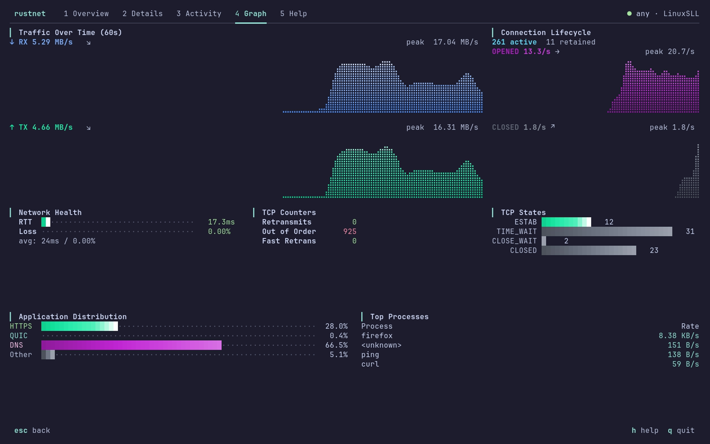
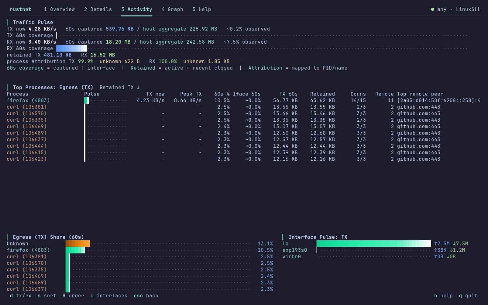

<p align="center">
  
</p>

<p align="center">
  <h1 align="center">RustNet</h1>
  <p align="center">
    <strong>Per-process network monitoring for terminals and automation: live TCP, UDP, and QUIC connections with deep packet inspection, sandboxed by default.</strong>
  </p>
  <p align="center">
    <a href="https://ratatui.rs/"></a>
    <a href="https://github.com/domcyrus/rustnet/actions"></a>
    <a href="https://crates.io/crates/rustnet-monitor"></a>
    <a href="https://github.com/domcyrus/rustnet/stargazers"></a>
    <a href="LICENSE"></a>
    <a href="https://github.com/domcyrus/rustnet/releases"></a>
    <a href="https://github.com/domcyrus/rustnet/pkgs/container/rustnet"></a>
    <a href="INSTALL.md"></a>
  </p>
</p>

<p align="center">
  <strong>English</strong> | <a href="README.zh-CN.md">简体中文</a> | <a href="README.ja.md">日本語</a>
</p>

<p align="center">
  
</p>

<p align="center">
  <em>Real-time visibility into every connection your machine makes, who owns it, and what protocol it's speaking. No tcpdump, X11 forwarding, or root piping.</em>
</p>

> **Documentation version:** On `main`, this README describes development code and may include unreleased features. For v1.6.0, use the [v1.6.0 documentation](https://github.com/domcyrus/rustnet/blob/v1.6.0/README.md). Check `rustnet --version` for your installed version and `rustnet --help` for its supported options.

## Features

> **Unreleased since v1.6.0:** WireGuard/OpenVPN detection, the Host tab, Health badges and sorting, the idle countdown, and improved Linux attribution of pre-existing sockets require development builds. The Activity browser, compact-layout controls, and `pid:` filter described below are also unreleased. See the [changelog](CHANGELOG.md#unreleased) for all pending changes.

- **Per-process attribution**: Every TCP, UDP, and QUIC connection mapped to its owning process, via eBPF on Linux, PKTAP on macOS, ETW with an automatic IP Helper fallback on Windows, and native APIs on FreeBSD. Details include PID, executable, user/group names, match confidence, and a capped parent-process chain on every platform. Wireshark and tcpdump can't do this; `netstat` / `ss` can't show live state.
- **Deep packet inspection**: Identify HTTP, HTTPS/TLS with SNI, DNS, SSH, FTP, QUIC, MQTT, BitTorrent, WireGuard, OpenVPN, STUN, NTP, mDNS, LLMNR, DHCP, SNMP, SSDP, and NetBIOS, without external dissectors.
- **Annotated PCAPNG export**: `--pcapng-export` writes a Wireshark-ready capture with process, PID, direction, DPI/SNI, and GeoIP embedded as per-packet comments. Open it in Wireshark and every packet already names its owning process, with no post-processing. Classic `--pcap-export` with a JSONL sidecar for offline correlation is also available.
- **Security sandboxing**: Landlock (Linux 5.13+), Seatbelt (macOS), token privilege drop + job-object child-process block (Windows). Drops privileges after initialization; a failed requested UID/GID drop stops startup before packet-processing workers run. See [SECURITY.md](SECURITY.md).
- **Network analytics**: Real-time round-trip times for TCP, QUIC handshakes, DNS responses, and ICMP echo, plus TCP retransmission, out-of-order, and fast-retransmit detection. Protocol-aware health badges surface TCP issues, explicit QUIC Retry/version events, and retries/timeouts for transaction-based UDP, with severity-first sorting in the Overview table. Passive DNS analytics add response codes, timeouts, latency percentiles, question names, and a compact health signal.
- **Smart connection lifecycle**: Protocol-aware timeouts; idle rows get a yellow-to-red stripe and removal countdown and soften toward gray. Toggle `t` to keep historic (closed) connections visible for forensics.
- **Vim/fzf-style filtering**: `port:`, `src:`, `dst:`, `sni:`, `process:`, `state:`, `proto:`, plus regex via `/(?i)pattern/`.
- **Headless automation (unreleased)**: Run without the TUI and stream versioned JSONL snapshots, or emit one final JSON snapshot, with the same connection filters used by the interactive view.
- **GeoIP enrichment**: Country lookups via local MaxMind GeoLite2. No network calls.
- **LAN device identification**: MAC address and vendor (from the embedded IEEE OUI database) for on-link peers and the gateway, learned passively from ARP traffic and shown in the details pane.
- **Kubernetes attribution** (optional `kubernetes` feature): connections mapped to their pod, namespace, and container, shown in the details pane, JSON/PCAPNG exports, and the `pod:`, `ns:`, `container:` filters. Enabled in the official Docker image; on a cluster, use the [kubectl-rustnet](https://github.com/domcyrus/kubectl-rustnet) plugin to run it as an ephemeral debug pod. See [USAGE.md](USAGE.md#--kubernetes-mode-optional-feature).
- **Cross-platform**: Linux, macOS, Windows, FreeBSD.

Packet parsing runs in parallel, while connection and annotated-export updates
keep capture order. Parallel workers group up to 16 already queued batches for
one ordered update, without waiting to fill the group. A sole processor parses
and updates each packet immediately, without staging DPI allocations. The queue
holds at most 10,000 packets, plus up to 1,600 in-flight packets per worker
(6,400 across at most four workers), separate from other app memory.
A full queue uses a 5 ms send timeout
before dropping that batch. On Linux, macOS, FreeBSD, and Windows, supported
capture backends wake the reader when new traffic arrives. A shared 10 ms idle
wait budget preserves shutdown and partial-batch flushing, with sleep polling
when native readiness is unavailable. This is not a per-packet delay. Bursts or sustained
overload can still drop packets in the queue or capture backend.

## Why RustNet?

RustNet fills the gap between simple connection tools (`netstat`, `ss`) and packet analyzers (`Wireshark`, `tcpdump`):

- **Process attribution**: See which application owns each connection. Wireshark cannot provide this because it only sees packets, not sockets.
- **Connection-centric view**: Track states, bandwidth, and protocols per connection in real-time
- **SSH-friendly**: TUI works over SSH so you can quickly see what's happening on a remote server without forwarding X11 or capturing traffic

RustNet complements packet capture tools. Use RustNet to see *what's making connections*. For direct Wireshark inspection, `--pcapng-export` writes live best-effort packet comments with PID/process context. For cleanup-time correlation, use `--pcap-export` plus the JSONL sidecar and optional `scripts/pcap_enrich.py`. See [PCAP Export](USAGE.md#pcap-export) and [Comparison with Similar Tools](ARCHITECTURE.md#comparison-with-similar-tools) for details.

Built on ratatui, libpcap, eBPF (libbpf-rs), DashMap, crossbeam, ring, MaxMind GeoLite2, and Landlock. See [ARCHITECTURE.md](ARCHITECTURE.md#dependencies) for the full dependency breakdown.

<details>
<summary><b>eBPF Enhanced Process Identification (Linux Default)</b></summary>

RustNet uses kernel eBPF programs by default on Linux for enhanced performance and lower overhead process identification.

**Process Names:**
- eBPF records the process group leader's TGID and `comm` name (a kernel field limited to 16 characters) rather than the acting thread's name, so multi-threaded applications show the main process name instead of thread names like "Socket Thread"
- RustNet then re-resolves the current name via `/proc/<tgid>/comm`, recovers comm-truncated names from the executable's file name (e.g. "chromium-browse" becomes "chromium-browser"), and resolves the full executable path shown in the Details view
- Short-lived processes that exit before this enrichment runs keep the eBPF-recorded 16-character name

**Fallback Behavior:**
- On Linux 5.11 and newer, a one-shot BPF task-file iterator inventories sockets that were already open at startup, including sockets owned by root and other users when RustNet runs with file capabilities
- When eBPF fails to load or lacks sufficient permissions, RustNet automatically falls back to standard procfs-based process identification
- Older kernels and procfs-only builds resolve names through procfs scanning, which has higher CPU overhead and can only inspect socket owners visible to the RustNet user
- eBPF is enabled by default; no special build flags needed

To disable eBPF and use procfs-only mode, build with:
```bash
cargo build --release --no-default-features
```

See [ARCHITECTURE.md](ARCHITECTURE.md) for technical information.

</details>

<details>
<summary><b>Process Activity and Host Monitoring</b></summary>

RustNet combines process-level traffic accounting with real-time network interface statistics:

- **Overview Tab**: Shows active interfaces with current rates, errors, and drops
- **Activity Tab** (press `3`): Ranks applications by Egress (TX) or Ingress (RX), with per-PID details, including retained and rolling traffic, rates, shares, connections, and destinations
- **Security Workflow**: Sort by Egress, identify an unexpected uploader, then inspect its top remote peer and retained traffic even after the connection closes
- **Host Tab** (press `5`): Shows TCP LISTEN sockets, UDP BOUND endpoints, aggregated TCP states, observed RTT, process ownership, and passive DNS analytics
- **Interface Details** (select Interfaces on Host): Shows comprehensive metrics for every interface
- **DNS Details** (select DNS on Host): Shows a rolling outcome summary, matched response latency, and the most active question names
- **Cross-Platform**: Linux (sysfs), macOS/FreeBSD (getifaddrs), Windows (GetIfTable2 API)
- **Smart Filtering**: Windows automatically excludes virtual/filter adapters

See [USAGE.md](USAGE.md#interface-statistics) for detailed documentation on interpreting interface statistics and platform-specific behavior.

**Metrics Available:**
- Total bytes and packets (RX/TX)
- Error counters (receive and transmit)
- Packet drops (queue overflows)
- Collisions (legacy, rarely used on modern networks)

Stats are collected every 2 seconds in a background thread with minimal performance impact.

</details>

## Screenshots

<table>
  <tr>
    <td align="center"><strong>Overview</strong><br>Connections table with live stats and sparklines<br></td>
    <td align="center"><strong>Details</strong><br>Per-connection SNI, cipher, GeoIP, DPI<br></td>
  </tr>
  <tr>
    <td align="center"><strong>Graph</strong><br>Traffic chart, app distribution, top processes<br></td>
    <td align="center"><strong>Activity</strong><br>Process egress/ingress, 60-second coverage, attribution, and remote peers<br></td>
  </tr>
</table>

## Quick Start

### Installation

**Homebrew (macOS / Linux):**
```bash
brew install rustnet
```

**Ubuntu (22.04 LTS+) / Linux Mint 21+ / Pop!_OS 22.04+:**
```bash
sudo add-apt-repository ppa:domcyrus/rustnet
# on Pop!_OS: sudo apt-manage add ppa:domcyrus/rustnet
sudo apt update && sudo apt install rustnet
```

**Fedora (42+):**
```bash
sudo dnf copr enable domcyrus/rustnet
sudo dnf install rustnet
```

**openSUSE Tumbleweed:**
```bash
sudo zypper addrepo https://download.opensuse.org/repositories/home:/domcyrus:/rustnet/openSUSE_Tumbleweed/home:domcyrus:rustnet.repo
sudo zypper refresh
sudo zypper install rustnet
```

**Arch Linux:**
```bash
sudo pacman -S rustnet
```

**Nix / NixOS:**
```bash
nix-shell -p rustnet
# Then inside the shell: sudo rustnet
```

**From crates.io:**
```bash
cargo install rustnet-monitor
```

**Windows (Chocolatey):**
```powershell
# Run in Administrator PowerShell
# RustNet v1.6.0 requires Npcap with "WinPcap API compatible mode" enabled
choco install rustnet
```

**Windows (Scoop):**
```powershell
scoop install rustnet
```

Install [Npcap](https://npcap.com) separately. For RustNet v1.6.0, enable "WinPcap API compatible mode" when installing Npcap.

**Other platforms:**
- **FreeBSD**: Download from [rustnet-bsd releases](https://github.com/domcyrus/rustnet-bsd/releases)
- **Docker, source builds, other Linux distros**: See [INSTALL.md](INSTALL.md) for detailed instructions

### Running RustNet

Packet capture requires elevated privileges:

```bash
# Quick start (all platforms)
sudo rustnet

# Linux: Grant capabilities to run without sudo (recommended)
sudo setcap 'cap_net_raw,cap_bpf,cap_perfmon+eip' $(which rustnet)
rustnet
```

**Common options:**
```bash
rustnet -i eth0              # Specify network interface
rustnet --show-localhost     # Show localhost connections
rustnet --no-resolve-dns     # Disable reverse DNS lookups (enabled by default)
rustnet -r 500               # Set refresh interval (ms)
rustnet --theme tokyo-night  # Theme: muted (default), vivid, catppuccin-mocha, tokyo-night, gruvbox, nord
rustnet --pcapng-export capture.pcapng  # Annotated PCAPNG for Wireshark
```

The TUI remains the default. For scripts and services, use headless mode:

> **Unreleased:** `--headless`, `--duration`, `--output`, and `--filter` are unavailable in v1.6.0. To use the examples below, [build from current `main`](INSTALL.md#building-from-source) or wait for a release that includes headless mode.

```bash
rustnet --headless                                      # Stream JSONL snapshots
rustnet --headless --duration 30 --output json         # Emit one final snapshot
rustnet --headless --filter 'process:curl app:https'   # Apply a connection filter
```

`--output jsonl` is the headless default and streams versioned snapshots at the configured refresh interval. `--output json` emits one final versioned snapshot when monitoring stops. `--duration` stops capture after the requested number of seconds, and `--filter` accepts the same syntax as the TUI. In headless mode, stdout contains machine-readable output only. Capture startup failures exit with a nonzero status.

Snapshot connection IDs remain stable through archival and distinguish reused endpoints. Traffic rates are explicitly named `outgoing_bytes_per_second` and `incoming_bytes_per_second`. A shutdown timeout reports `stopping` with the unfinished worker count and exits with a nonzero status.

Snapshot JSONL is sampled state, not complete traffic history. Short-lived or reused connections can be missing even when packet-drop counters are zero. Use a separate `--pcap-export capture.pcap` for packet-level analysis, check capture drops, and validate against an independent capture when completeness matters. Full snapshots can be expensive at high connection counts; choose the refresh interval and retention budget for your workload. See [traffic history and capture files](USAGE.md#traffic-history-and-capture-files).

Redirected stdout, JSON logs, PCAP exports and their sidecars, and PCAPNG exports must use distinct output files. RustNet rejects overlapping destinations before truncating configured outputs, but shell `>` redirection can already have truncated a file before startup.

The theme and per-color overrides can also be set in `~/.config/rustnet/config.toml`; `--theme` takes precedence. See [USAGE.md](USAGE.md#--theme-preset) for the schema.

See [INSTALL.md](INSTALL.md) for detailed permission setup and [USAGE.md](USAGE.md) for complete options.

> If you set capabilities but the TUI still shows `eBPF unavailable`, see
> [eBPF Unavailable Despite Capabilities Being Set](INSTALL.md#ebpf-unavailable-despite-capabilities-being-set)
> in the troubleshooting section.

## Keyboard Controls

> **Unreleased navigation changes:** `5` opens Host, `h` opens contextual help, and `v` / `Shift+v` switch sections. In v1.6.0, `5` opens Help and `i` on Activity opens interface details.

| Key | Action |
|-----|--------|
| `q` | Quit (press twice to confirm) |
| `Ctrl+C` | Quit immediately |
| `x` | Clear all connections (press twice to confirm) |
| `Tab` | Next tab |
| `Shift+Tab` | Previous tab |
| `1`–`5` | Jump to Overview / Details / Activity / Graph / Host |
| `↑/k` `↓/j` | Navigate up/down |
| `g` `G` | Jump to first/last connection |
| `Enter` | View connection details |
| `Esc` | Go back or clear filter |
| `c` | Copy remote address |
| `p` | Toggle service names/ports |
| `d` | Toggle hostnames/IPs on Overview or Egress/Ingress on Activity |
| `s` `S` | Cycle sort columns / toggle direction |
| `a` | Toggle process grouping |
| `Space` | Expand/collapse process group |
| `←` / `→` or `l` | Collapse/expand group |
| `PageUp/PageDown` or `Ctrl+B/F` | Page navigation |
| `t` | Toggle historic (closed) connections |
| `v` / `Shift+v` | Next / previous section on compact layouts or Host |
| `[` / `]` | Previous / next main tab |
| `i` | Toggle System sidebar on wide Overview layouts |
| `r` | Reset view (grouping, sort, filter) |
| `/` | Enter filter mode |
| `h` | Toggle contextual help for the active tab |

On Overview, the bottom status bar highlights process grouping and historic
connections while those modes are active. In grouped mode it also shows
`space expand` or `space collapse` for the selected process group.

Activity combines PIDs with the same process name into one application row.
Enter opens its summary, then its PID list, then individual process details;
Esc returns one level. Both lists scroll and preserve selection. Press `o` to
open matching connections in Overview, replacing its filter and enabling history.
Activity totals remain independent of Overview filters. Compact layouts use
`v` / Shift+`v` for Applications and Capture; interface inventory stays in Host.
In Activity, Egress (TX) is outgoing traffic and Ingress (RX) is incoming traffic
from the perspective of the device running RustNet. The contextual help on each
tab and Host section explains what that view is for before listing its controls.

See [USAGE.md](USAGE.md) for detailed keyboard controls and navigation tips.

## Filtering & Sorting

**Quick filtering examples:**
```
/google                        # Search for "google" anywhere
/port:443                      # Filter by port
/process:firefox               # Filter by process
/state:established             # Filter by connection state
/dport:443 sni:github.com      # Combine filters
```

**Sorting:**
- Press `s` to cycle through sortable columns (Process, Addresses, Service, Application, State, Bandwidth)
- Press `S` (Shift+s) to toggle sort direction
- Find bandwidth hogs: Press `s` until "Bandwidth Total ↓" appears (sorts by combined up+down speed)

See [USAGE.md](USAGE.md) for complete filtering syntax and sorting guide.

<details>
<summary><b>Advanced Filtering Examples</b></summary>

**Keyword filters:**
- `port:44` - Ports containing "44" (443, 8080, 4433)
- `sport:80` - Source ports containing "80"
- `dport:443` - Destination ports containing "443"
- `src:192.168` - Source IPs containing "192.168"
- `dst:github.com` - Destinations containing "github.com"
- `process:ssh` - Process names containing "ssh" (`process:unknown` includes unresolved names)
- `pid:1234` - Exact process ID (unreleased)
- `sni:api` - SNI hostnames containing "api"
- `app:openssh` - SSH connections using OpenSSH
- `state:established` - Filter by protocol state
- `proto:tcp` - Filter by protocol type

**State filtering:**
- `state:syn_recv` - Half-open connections (SYN flood detection)
- `state:established` - Established connections only
- `state:quic_connected` - Active QUIC connections
- `state:dns_query` - DNS query connections

**Combined examples:**
- `sport:80 process:nginx` - Nginx connections from port 80
- `dport:443 sni:google.com` - HTTPS to Google
- `process:firefox state:quic_connected` - Firefox QUIC connections
- `dport:22 app:openssh state:established` - Established OpenSSH connections

</details>

<details>
<summary><b>Connection Lifecycle & Visual Indicators</b></summary>

RustNet uses smart timeouts and visual warnings before removing connections:

**Visual staleness indicators:**
- **Full color**: Active (< 50% of timeout)
- **Countdown**: Idle (50-100% of timeout); a `▎` stripe at the left edge and the time left in the bandwidth column run yellow through orange to red as removal nears, while the identifying columns soften toward gray
- **Gray**: Historic, closed and archived, shown as a faint row with `closed` in the State column (toggle `t` to show)

**Protocol-aware timeouts:**
- **HTTP/HTTPS**: 10 minutes (supports keep-alive)
- **SSH**: 30 minutes (long sessions)
- **Generic TCP established**: 5 minutes
- **QUIC connected**: 3 minutes (or peer's transport-param idle timeout, when present); `Initial`/`Handshaking`: 60 seconds
- **DNS**: 30 seconds
- **TCP CLOSED**: 15-second archival grace

Example: An HTTP connection shows its countdown from 5 min, is removed at 10 min, and then appears as a gray historic row when history is on.

See [USAGE.md](USAGE.md) for complete timeout details.

</details>

## Documentation

- **[INSTALL.md](INSTALL.md)** - Detailed installation instructions for all platforms, permission setup, and troubleshooting
- **[USAGE.md](USAGE.md)** - Complete usage guide including command-line options, filtering, sorting, and logging
- **[SECURITY.md](SECURITY.md)** - Security features including Landlock sandboxing and privilege management
- **[ARCHITECTURE.md](ARCHITECTURE.md)** - Technical architecture, platform implementations, and performance details
- **[CONTRIBUTING.md](CONTRIBUTING.md)** - Contribution workflow, quality requirements, and project guidelines
- **[PROFILING.md](PROFILING.md)** - Performance profiling guide with flamegraph setup and optimization tips
- **[ROADMAP.md](ROADMAP.md)** - Planned features and future improvements
- **[RELEASE.md](RELEASE.md)** - Release process for maintainers

## Contributing

Contributions are welcome! Please see [CONTRIBUTING.md](CONTRIBUTING.md) for guidelines on how to contribute.

See [CONTRIBUTORS.md](CONTRIBUTORS.md) for a list of people who have contributed to this project.

## License

This project is licensed under the Apache License, Version 2.0 - see the [LICENSE](LICENSE) file for details.

## Acknowledgments

- Built with [ratatui](https://github.com/ratatui-org/ratatui) for the terminal UI
- Packet capture powered by [libpcap](https://www.tcpdump.org/)
- Inspired by tools like `tshark/wireshark/tcpdump`, `sniffnet`, `netstat`, `ss`, `iftop`, and [bandwhich](https://github.com/imsnif/bandwhich)
- Some code is vibe coded (OMG) / may the LLM gods be with you

---

## Documentation Moved

Some sections have been moved to dedicated files for better organization:

- **Permissions Setup**: Now in [INSTALL.md - Permissions Setup](INSTALL.md#permissions-setup)
- **Installation Instructions**: Now in [INSTALL.md](INSTALL.md)
- **Detailed Usage**: Now in [USAGE.md](USAGE.md)
- **Architecture Details**: Now in [ARCHITECTURE.md](ARCHITECTURE.md)
