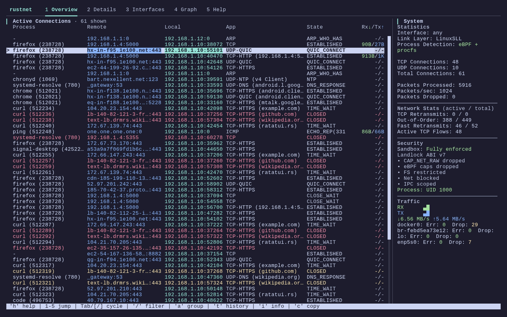
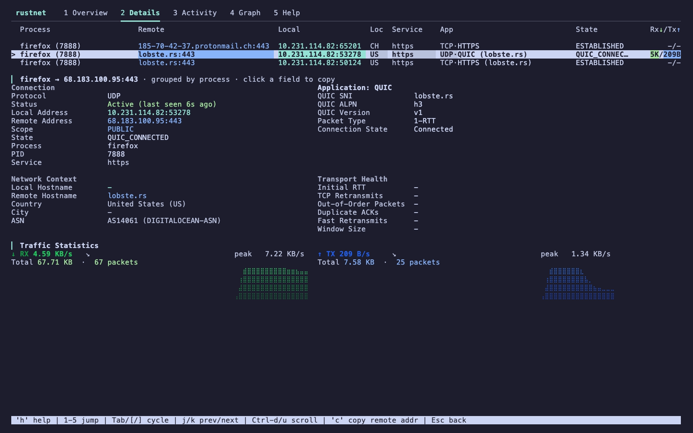
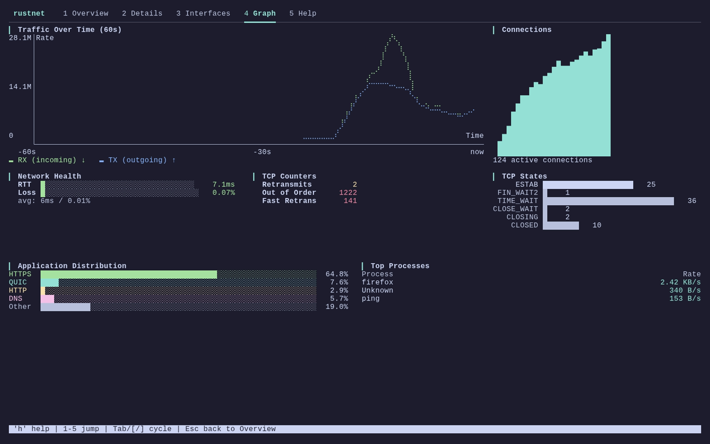
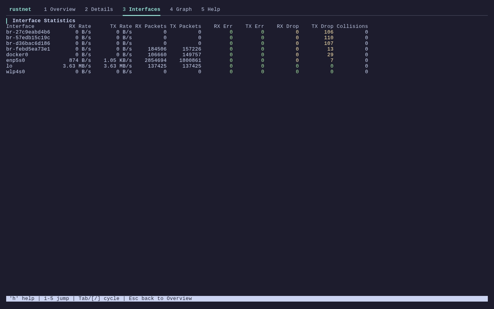

<p align="center">
  <h1 align="center">RustNet</h1>
  <p align="center">
    <strong>面向终端的进程级网络监控工具：实时呈现 TCP、UDP、QUIC 连接，自带深度包检测，默认沙箱隔离运行。</strong>
  </p>
  <p align="center">
    <a href="https://ratatui.rs/"></a>
    <a href="https://github.com/domcyrus/rustnet/actions"></a>
    <a href="https://crates.io/crates/rustnet-monitor"></a>
    <a href="https://github.com/domcyrus/rustnet/stargazers"></a>
    <a href="LICENSE"></a>
    <a href="https://github.com/domcyrus/rustnet/releases"></a>
    <a href="https://github.com/domcyrus/rustnet/pkgs/container/rustnet"></a>
  </p>
</p>

<p align="center">
  <a href="README.md">English</a> | <strong>简体中文</strong>
</p>

<p align="center">
  
</p>

<p align="center">
  <em>实时洞察机器对外发起的每一条连接：谁在使用它、走的是什么协议。无需 tcpdump，无需 X11 转发，也不必把 root 权限传递下去。</em>
</p>

## 功能特性

- **进程级归属识别**：每一条 TCP、UDP、QUIC 连接都能追溯到所属进程。Linux 使用 eBPF，macOS 使用 PKTAP，Windows 与 FreeBSD 则走原生 API。Wireshark 与 tcpdump 做不到这一点；`netstat` / `ss` 也无法展示实时状态。
- **深度包检测**：无需外部解析器即可识别 HTTP、带 SNI 的 HTTPS/TLS、DNS、SSH、QUIC、MQTT、BitTorrent、STUN、NTP、mDNS、LLMNR、DHCP、SNMP、SSDP 及 NetBIOS。
- **安全沙箱**：Linux 5.13+ 使用 Landlock，macOS 使用 Seatbelt，Windows 通过 token 降权 + job-object 阻止子进程创建。libpcap 初始化完成后立即丢弃特权。详见 [SECURITY.md](SECURITY.md)。
- **TCP 网络分析**：实时统计重传、乱序包、快重传，既有逐连接视图也有汇总视图。
- **智能连接生命周期**：按协议设置超时，以白 → 黄 → 红的颜色指示过期程度。按 `t` 可保留历史（已关闭）连接以便事后追溯。
- **Vim / fzf 风格过滤**：支持 `port:`、`src:`、`dst:`、`sni:`、`process:`、`state:`、`proto:`，以及 `/(?i)pattern/` 形式的正则。
- **GeoIP 增强**：基于本地 MaxMind GeoLite2 数据库查询国家信息，不发起任何网络请求。
- **跨平台**：Linux、macOS、Windows、FreeBSD。

## 为什么选 RustNet？

RustNet 填补了简单连接工具(`netstat`、`ss`)与数据包分析器(`Wireshark`、`tcpdump`)之间的空白：

- **进程归属**：看清每条连接归哪个应用所有。Wireshark 看不到这一层，因为它只看包，不看 socket。
- **以连接为中心的视图**：逐连接实时追踪状态、带宽与协议。
- **SSH 友好**：TUI 可直接在 SSH 会话中运行，远端服务器上发生了什么一眼可见，不必转发 X11 或抓包再回传。

RustNet 与抓包工具是互补关系。用 RustNet 看清*谁在发起连接*；若要深入取证，可用 `--pcap-export` 抓取附带进程信息的数据包，再借 `scripts/pcap_enrich.py` 富化后，在 Wireshark 中结合完整的 PID 与进程上下文分析。参见 [PCAP 导出](USAGE.md#pcap-export) 与 [同类工具对比](ARCHITECTURE.md#comparison-with-similar-tools)。

基于 ratatui、libpcap、eBPF(libbpf-rs)、DashMap、crossbeam、ring、MaxMind GeoLite2 与 Landlock 构建。完整依赖清单见 [ARCHITECTURE.md](ARCHITECTURE.md#dependencies)。

<details>
<summary><b>基于 eBPF 的增强型进程识别(Linux 默认)</b></summary>

RustNet 在 Linux 上默认使用内核 eBPF 程序进行进程识别，从而获得更高的性能与更低的开销。但这种方式也有一些重要的限制需要了解：

**进程名长度限制：**
- eBPF 使用内核的 `comm` 字段，该字段最多只有 16 个字符
- 显示的是任务 / 线程的命令名，而非完整的可执行路径
- 多线程应用往往展示线程名而非主进程名

**真实场景示例：**
- **Firefox**：可能显示为 "Socket Thread"、"Web Content"、"Isolated Web Co" 或 "MainThread"
- **Chrome**：可能显示为 "ThreadPoolForeg"、"Chrome_IOThread"、"BrokerProcess" 或 "SandboxHelper"
- **Electron 应用**：经常显示为 "electron"、"node" 或内部线程名
- **系统进程**：展示截断后的名字，如 "systemd-resolve" → "systemd-resolve"

**回退行为：**
- 当 eBPF 加载失败或权限不足时，RustNet 会自动回退到基于 procfs 的标准进程识别方式
- 标准模式可以拿到完整进程名，但 CPU 开销更高
- eBPF 默认启用，无需任何特殊编译参数

如需关闭 eBPF、仅使用 procfs 模式，请这样构建：
```bash
cargo build --release --no-default-features
```

技术细节见 [ARCHITECTURE.md](ARCHITECTURE.md)。

</details>

<details>
<summary><b>网络接口统计监控</b></summary>

RustNet 在所有支持的平台上提供实时的网络接口统计：

- **概览标签页**：展示当前活跃的接口，包含速率、错误数与丢包数
- **接口标签页**(按 `i`)：以详细表格呈现各接口的完整指标
- **跨平台**：Linux(sysfs)、macOS / FreeBSD(getifaddrs)、Windows(GetIfTable2 API)
- **智能过滤**：Windows 上自动剔除虚拟 / 过滤类适配器

如何解读接口统计以及各平台的差异，详见 [USAGE.md](USAGE.md#interface-statistics)。

**可用指标：**
- 总字节数与包数(RX / TX)
- 错误计数(收 / 发)
- 丢包数(队列溢出)
- 冲突数(传统指标，现代网络中很少出现)

数据由后台线程每 2 秒采集一次，对性能影响极小。

</details>

## 截图

<table>
  <tr>
    <td align="center"><strong>概览</strong><br>连接列表与实时统计、迷你折线图<br></td>
    <td align="center"><strong>详情</strong><br>逐连接展示 SNI、加密套件、GeoIP、DPI<br></td>
  </tr>
  <tr>
    <td align="center"><strong>图表</strong><br>流量曲线、应用分布、Top 进程<br></td>
    <td align="center"><strong>接口</strong><br>各接口 RX / TX 历史曲线、错误与丢包<br></td>
  </tr>
</table>

## 快速上手

### 安装

**Homebrew(macOS / Linux):**
```bash
brew tap domcyrus/rustnet
brew install rustnet
```

**Ubuntu(25.10+):**
```bash
sudo add-apt-repository ppa:domcyrus/rustnet
sudo apt update && sudo apt install rustnet
```

**Fedora(42+):**
```bash
sudo dnf copr enable domcyrus/rustnet
sudo dnf install rustnet
```

**Arch Linux:**
```bash
sudo pacman -S rustnet
```

**通过 crates.io:**
```bash
cargo install rustnet-monitor
```

**Windows(Chocolatey):**
```powershell
# 需在管理员权限的 PowerShell 中执行
# 需要先安装 Npcap(https://npcap.com)，并启用 "WinPcap API-compatible Mode"
choco install rustnet
```

**其他平台：**
- **FreeBSD**：从 [rustnet-bsd releases](https://github.com/domcyrus/rustnet-bsd/releases) 下载
- **Docker、源码构建、其他 Linux 发行版**：详见 [INSTALL.md](INSTALL.md)

### 运行 RustNet

抓包需要更高的权限：

```bash
# 快速启动(所有平台)
sudo rustnet

# Linux：为可执行文件赋予 capability，即可免 sudo 运行(推荐)
sudo setcap 'cap_net_raw,cap_bpf,cap_perfmon+eip' $(which rustnet)
rustnet
```

**常用参数：**
```bash
rustnet -i eth0              # 指定网络接口
rustnet --show-localhost     # 显示 localhost 上的连接
rustnet --no-resolve-dns     # 关闭反向 DNS 解析(默认开启)
rustnet -r 500               # 设置刷新间隔(毫秒)
```

权限配置详情见 [INSTALL.md](INSTALL.md)，完整参数说明见 [USAGE.md](USAGE.md)。

> 如果已经设置了 capability，但 TUI 仍然提示 `eBPF unavailable`，请参阅 [INSTALL.md 的排障章节](INSTALL.md#ebpf-unavailable-despite-capabilities-being-set)。

## 键盘控制

| 按键 | 作用 |
|-----|--------|
| `q` | 退出(连按两次确认) |
| `Ctrl+C` | 立即退出 |
| `x` | 清空所有连接(连按两次确认) |
| `Tab` | 切换标签页 |
| `i` | 切换接口统计视图 |
| `↑/k` `↓/j` | 上下移动 |
| `g` `G` | 跳到第一条 / 最后一条连接 |
| `Enter` | 查看连接详情 |
| `Esc` | 返回或清除过滤器 |
| `c` | 复制远端地址 |
| `p` | 在服务名与端口之间切换 |
| `d` | 在主机名与 IP 之间切换 |
| `s` `S` | 切换排序列 / 切换排序方向 |
| `a` | 切换按进程分组 |
| `Space` | 展开 / 折叠进程分组 |
| `←/→` 或 `h/l` | 折叠 / 展开当前分组 |
| `PageUp/PageDown` 或 `Ctrl+B/F` | 翻页 |
| `t` | 切换是否显示历史（已关闭）连接 |
| `r` | 重置视图(分组、排序、过滤) |
| `/` | 进入过滤模式 |
| `h` | 切换帮助 |

完整键位说明与导航技巧见 [USAGE.md](USAGE.md)。

## 过滤与排序

**快速过滤示例：**
```
/google                        # 全局搜索 "google"
/port:443                      # 按端口过滤
/process:firefox               # 按进程过滤
/state:established             # 按连接状态过滤
/dport:443 sni:github.com      # 组合多个过滤条件
```

**排序：**
- 按 `s` 在可排序的列之间循环切换(协议、地址、状态、服务、带宽、进程)
- 按 `S`(Shift+s)切换升序 / 降序
- 想抓出带宽大户：连续按 `s` 直到显示 "Down/Up ↓"(按上下行合计速度排序)

完整的过滤语法与排序说明见 [USAGE.md](USAGE.md)。

<details>
<summary><b>高级过滤示例</b></summary>

**关键字过滤：**
- `port:44` —— 端口号包含 "44" 的连接(443、8080、4433)
- `sport:80` —— 源端口包含 "80"
- `dport:443` —— 目的端口包含 "443"
- `src:192.168` —— 源 IP 包含 "192.168"
- `dst:github.com` —— 目的地址包含 "github.com"
- `process:ssh` —— 进程名包含 "ssh"
- `sni:api` —— SNI 主机名包含 "api"
- `app:openssh` —— 使用 OpenSSH 的 SSH 连接
- `state:established` —— 按协议状态过滤
- `proto:tcp` —— 按协议类型过滤

**状态过滤：**
- `state:syn_recv` —— 半开连接(可用于发现 SYN flood)
- `state:established` —— 仅显示已建立的连接
- `state:quic_connected` —— 活跃的 QUIC 连接
- `state:dns_query` —— DNS 查询连接

**组合示例：**
- `sport:80 process:nginx` —— Nginx 从 80 端口发出的连接
- `dport:443 sni:google.com` —— 到 Google 的 HTTPS
- `process:firefox state:quic_connected` —— Firefox 的 QUIC 连接
- `dport:22 app:openssh state:established` —— 已建立的 OpenSSH 连接

</details>

<details>
<summary><b>连接生命周期与可视化指示</b></summary>

RustNet 在移除连接前会先用智能超时机制与颜色给出预警：

**过期程度的颜色指示：**
- **白色**：活跃(< 75% 的超时时间)
- **黄色**：开始过期(75% – 90% 的超时时间)
- **红色**：即将过期(> 90% 的超时时间)

**按协议设定的超时：**
- **HTTP / HTTPS**：10 分钟(支持 keep-alive)
- **SSH**：30 分钟(适配长会话)
- **TCP 活跃**：10 分钟；**TCP 空闲**：5 分钟
- **QUIC 已连接**：3 分钟(若对端通过 transport 参数声明了 idle timeout，则以对端为准);`Initial` / `Handshaking` 阶段：60 秒
- **DNS**：30 秒
- **TCP CLOSED**：5 秒

举例：一条 HTTP 连接会在第 7.5 分钟变黄，第 9 分钟变红，第 10 分钟被移除。

完整超时说明见 [USAGE.md](USAGE.md)。

</details>

## 文档

- **[INSTALL.md](INSTALL.md)** —— 各平台的详细安装说明、权限配置与排障
- **[USAGE.md](USAGE.md)** —— 完整使用手册，涵盖命令行参数、过滤、排序与日志
- **[SECURITY.md](SECURITY.md)** —— 安全特性，包括 Landlock 沙箱与权限管理
- **[ARCHITECTURE.md](ARCHITECTURE.md)** —— 技术架构、各平台实现与性能细节
- **[PROFILING.md](PROFILING.md)** —— 性能分析指南，含 flamegraph 配置与优化建议
- **[ROADMAP.md](ROADMAP.md)** —— 已规划的功能与后续改进
- **[RELEASE.md](RELEASE.md)** —— 维护者发布流程

## 参与贡献

欢迎贡献！请阅读 [CONTRIBUTING.md](CONTRIBUTING.md) 了解贡献流程。

历来的贡献者名单见 [CONTRIBUTORS.md](CONTRIBUTORS.md)。

## 许可证

本项目采用 Apache License 2.0 许可证，详见 [LICENSE](LICENSE) 文件。

## 致谢

- 终端 UI 基于 [ratatui](https://github.com/ratatui-org/ratatui) 构建
- 抓包能力由 [libpcap](https://www.tcpdump.org/) 提供
- 灵感来自 `tshark/wireshark/tcpdump`、`sniffnet`、`netstat`、`ss`、`iftop`，以及 [bandwhich](https://github.com/imsnif/bandwhich)
- 部分代码靠手感写出(OMG)/ 愿 LLM 之神与你同在

---

## 已迁移的文档

部分章节已迁移到独立文件，以便更好地组织内容：

- **权限配置**：迁移至 [INSTALL.md — 权限配置](INSTALL.md#permissions-setup)
- **安装说明**：迁移至 [INSTALL.md](INSTALL.md)
- **详细用法**：迁移至 [USAGE.md](USAGE.md)
- **架构细节**：迁移至 [ARCHITECTURE.md](ARCHITECTURE.md)
